# Introduction to the Internet of Things (IoT), Node Red, and the Raspberry Pi

### Cybersecurity First Principles in this lesson

* __Abstraction__: An abstraction is a representation of an object or concept. It could be something
such as a door, a speedometer, or a data structure in computer science. Abstraction decouples the design from the implementation. The gauges in an automobile are an abstraction of the performance of a car. A map is an abstraction of the earth.

* __Least Privilege__: One of the ways to protect information is by limiting what people can see and do with your information and resources. The principle of least privilege says to allow the minimum number of privileges necessary to accomplish the task.

* __Minimization__: Minimization refers to having the least functionality necessary in a program or device. The goal of minimization is to simplify and decrease the number of ways that software can be exploited. This can include **turning off ports that are not needed**, reducing the amount of code running on a machine, and/or turning off unneeded features in an application. This lesson focuses specifically on turning off ports that aren't in use.

* __Modularization__: The concept of modularity is like building blocks. Each block (or module) can be put in or taken out from a bigger project. Each module has its own separate function that is interchangeable with other modules.

* __Resource Encapsulation__: Encapsulation is an object oriented concept where all data and functions required
to use the resource are packaged into a single self-contained component. The goal is to only allow access or manipulation of the resource in the way the designer intended. An example, assume a flag pole is the object. There are fixed methods on how the flag pole is to be used. Put the flag on, take the flag off, raise or lower the flag. Nothing else can be done to the flag pole.

* __Simplicity__: Simplicity allows a person to better understand hardware and software. Without the clutter of unnecessarily complicated code and interfaces, the software will be more understandable by people that will update the code when requirements change. It will be easier to understand by the testers and they will be able to spot problems sooner. By keeping software as simple and as focused as possible, the reliability and security is greatly increased.

### Introduction
Let’s build an IoT device – wait, just what is the IoT – should I care?  I’m afraid to ask – Is it secure?


In this lesson we will take a close look at IoT and the associated security implications by building a simple IoT application on a Raspberry Pi using a program called Node-Red.

### Goals
We will continue our work towards our GenCyber camp purpose with the below goals for this lesson
* Use Node-Red to develop a simple IoT application on a Raspberry Pi
*	Integrate the If This Then That (IFTTT) service as a IoT cloud service
* Recall how the cybersecurity first principles of abstraction, least privilege, minimization, modularization, resource encapsulation, and simplicity apply to IoT applications.

### Materials Required

* Raspberry Pi
* Internet connections

### Prerequisite lessons
[Raspberry Pi Intro](../raspberry-pi-intro/README.md)

 ### Table of Contents
 <!-- TOC START min:1 max:3 link:true update:true -->
 - [Cybersecurity First Principles in this lesson](#cybersecurity-first-principles-in-this-lesson)
 - [Introduction](#introduction)
 - [Goals](#Goals)
 - [Materials Required](#materials-required)
 - [Prerequisite lessons](#prerequisite-lessons)
 - [What is the IoT](#what-is-the-iot)
 - [A Simple IoT Example](#a-simple-iot-example)
 - [Step 1: Install and update needed programs](#step-1-install-and-update-needed-programs)
 - [Step 2: Start Node-Red](#step-2-start-node-red)
 - [Step 3: Start Firefox](#step-3-start-firefox)
 - [Step 4: Create an IFTTT account](#step-4-create-an-IFTTT-account)
 - [Step 5: Create your first Node-Red flow](#step-5-create-your-first-node-red-flow)
 - [Step 6: Link flow to IFTTT](#step-6-link-flow-to-ifttt)
 - [Step 7: Build an IFTTT Recipe](#step-7-build-an-ifttt-recipe)
 - [Step 8: Test it!](#step-8-test-it)
 - [A Second Example](#a-second-example)
 - [Step 1: Add a new flow](#add-a-new-flow)
 - [Step 2: Build your new flow](#step-2-build-your-new-flow)
 - [Step 3: Test it!](#step-3-test-it!)
 - [Evaluation](#evaluation)
 - [Additional Resources](#additional-resources)
 - [Acknowledgements](#acknowledgements)
 - [License](#license)

 <!-- TOC END -->

### What is the IoT

 The IoT is the term applied to the many internet connected devices now occupying space in our lives.  Take a look through your house, you may have phones, tablets, laptops, fitbits, televisions, thermostats, smoke detectors, bathroom scales, refrigerators, light bulbs, and who knows what else all connected to the internet.

 

 These devices communicate with you, perhaps a cloud server, maybe even each other.  Although some devices such as phones or tables have very powerful operating systems and security features many IoT devices such as thermostats or fitbits don’t have security features due to the added cost and drain on batteries.  Is that a problem?  The general consensus amongst security experts is this is like running with scissors.  It may help you get a task done but at some point you may find the results painful.  Where do we start with addressing the issue?  Let’s start by taking a very generalized look at an IoT device.

 

 In a very general sense an IoT device is a device that may have sensors (_Inputs_) such as thermometers or light detectors, actuators (_outputs_) such as switches or alarms, a processor (like your _Raspberry Pi_ running _Node-Red_) to make sense of the data and direct actions, and a gateway (_network connection_) to interact with users and other systems.  An IoT device can make our lives much easier, or if someone who wants to do harm gets access to the device they could steal data or take control of objects in your house or business.


* Discuss with students some of the ways compromise of IoT devices could lead to harm, perhaps through information leakage or loss of control of devices.

By properly applying the Cybersecurity First Principles we can reduce the risk that someone can take over our IoT device and cause us harm.  The platform we will use to explore the IoT is our Raspberry Pi running a program called Node-Red.  Let's jump right into it.

### A Simple IoT Example
### Step 1: Install and update needed programs
The first thing we need to do is install and update a few needed programs.  Respond yes to any prompts you receive during the following operations.

* Install the Firefox Browser - Node Red works best with Firefox.  Remember we need to use the command _sudo_ to preface the install command due to the Raspberry Pi implementing the cybersecurity first principle of __Least Privilege__

```bash
sudo apt-get install firefox-esr
```

* Install npm - This will allow us to install additional capabilities, called nodes, into Node-Red

```bash
sudo apt-get install npm
```

```bash
sudo npm i -g npm@2.x
```

* Update Node-Red - this operations may take several minutes

```bash
update-nodes-and-nodered
```

* Install nodes for the IFTTT service and Raspberry Pi camera

```bash
cd ~/.node-red
npm install node-red-contrib-ifttt
npm install node-red-contrib-camerapi
```

### Step 2: Start Node-Red
On the Raspberry Pi desktop select _menu_, _Programming_, _Node-RED_

### Step 3: Start Firefox
On the Raspberry Pi desktop select _menu_, _Internet_, _Firefox ESR_

### Step 4: Create an IFTTT account
IFTTT (If This Then That) is a cloud service that allows us to automate actions, if the service receives a certain input, then it will execute a pre-selected action.  We will use the IFTTT service with Node-Red to interface with some common cloud services.

* In Firefox navigate to https://littlebits.cc/login and click _Sign up_
* Walk through the online instructions to create your account
* Once registration is complete, click search and enter Webhooks

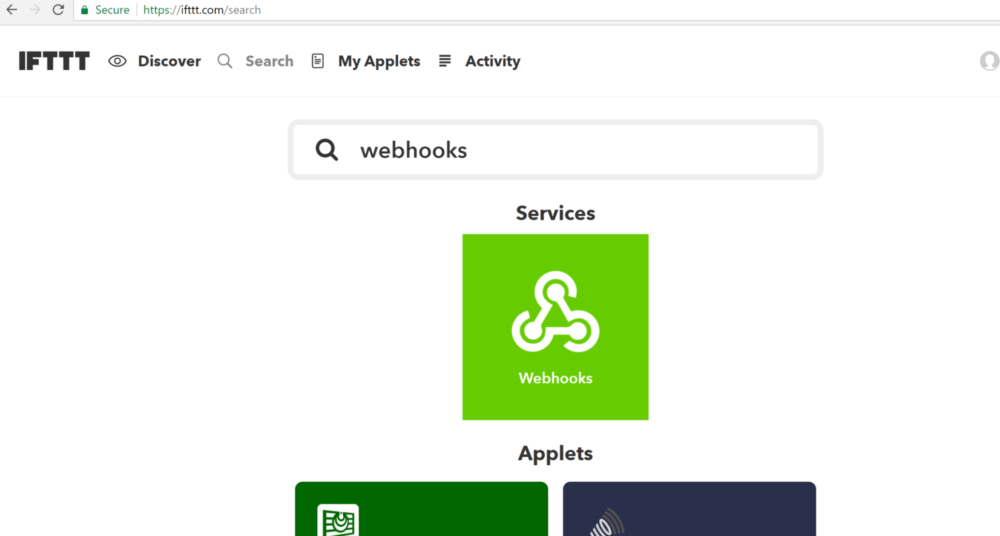

* Click the _Connect_ button

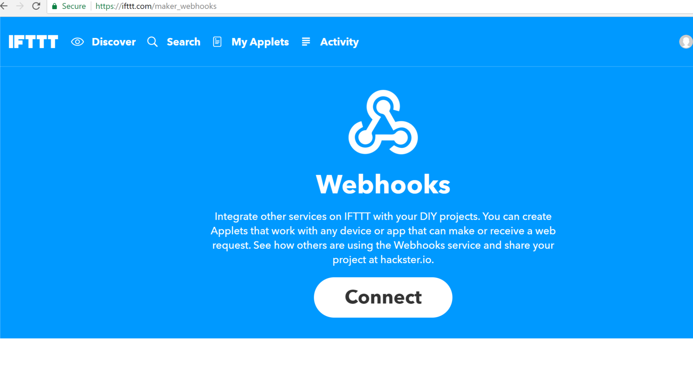

* We are done with the IFTTT web site for now but don't close the tab yet, we'll be back here shortly

### Step 5: Create your first Node-Red flow
Programs in Node-Red are called flows and they can be very simple or very complex.  We will keep our first flows very simple but you will see you can do quite a bit with a simple flow.  Flows are made up of connected nodes.  Although each node is a single element in a flow there may be several actions which that flow generates.  This implementation of nodes and flows illustrate several examples of Cybersecurity First Principles:

* __Simplicity__: A flow simplifies all the activity which is being conducted in the background.  By studying a flow you can quickly get an idea of what actions are being executed.  This aids security as you can quickly understand the overall actions taking place vice getting lost in all the details.
* __Abstraction__: Each node presents a single action however there may be several steps occurring in the background.  The details are abstracted behind the node which represents the interior actions.
* __Modularization__: Each node is a building block in a flow.  Nodes can be swapped out to change the functionality of a flow without requiring changing the entire flow.
* __Resource Encapsulation__: You are unable to directly access several of the interior functions which are necessary for a flow to work.  Due to this internalization, or encapsulation, critical functions are protected from external misuse.

With those principles in mind let's start your first flow.

* Open a new tab in Firefox (keep the IFTTT tab open for now) and enter the address __http://127.0.0.1:1880__, this will bring up the web page for the node-red server running on _your_ Rasperry Pi.  127.0.0.1 is always the local address of the computer your are using.
* Drag a __timestamp__ node from the left pane, called the palette, into the flow

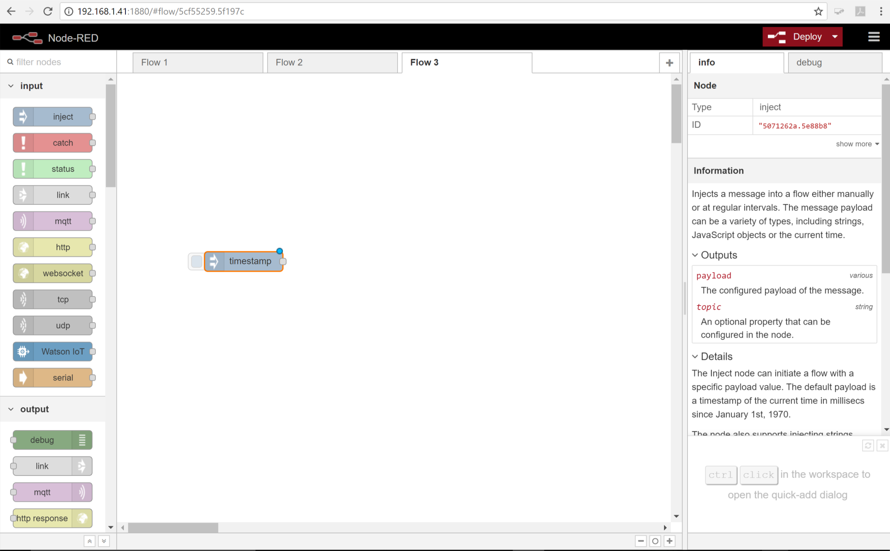

You will notice on the right hand side of the screen a description of the node is given.  This particular node returns the current system time when you click the button on the left side of the node.  For this flow we don't care about the time on the timestamp, we will just use it to indicate the button was pressed.

* Now scroll down through the palette and locate the IFTTT node under the output section and drag it into the flow.

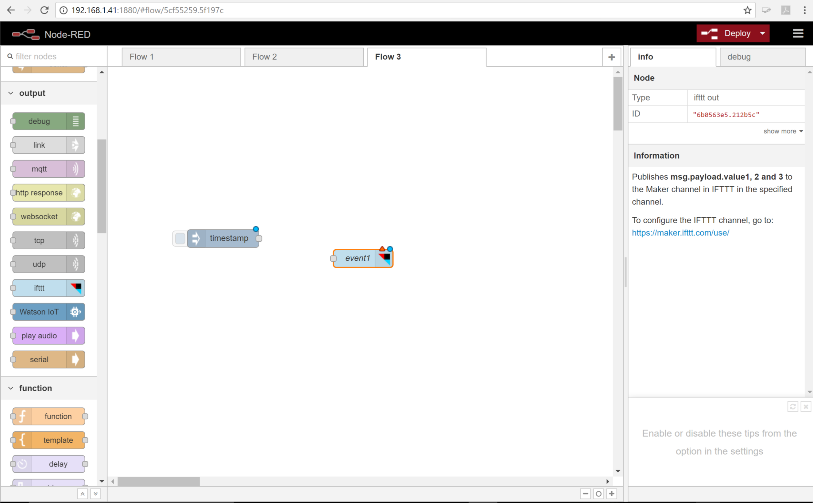

Your flow is now built but we still need to link it to your account on IFTTT.

### Step 6: Link flow to IFTTT
Remember the Cybersecurity First Principles of __Abstraction__ and __Resource Encapsulation__?  Now we get to take a closer look at how those principles are implemented.

* Double click on the IFTTT node, you will see a dialog box displayed which allows us to give the node some of the information it needs to do it's job.  Notice, you are not setting variables directly but entering them through a dialog.  This allows error checking and security checks to be done behind the scenes.

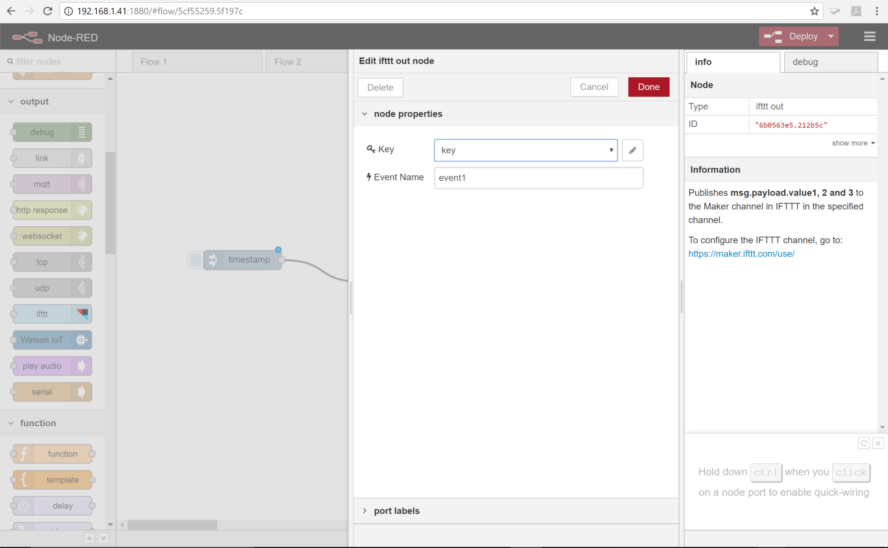

Now we need to fill in the first field named key.  This is a unique identifier which links this flow to _your_ IFTTT account.  To get this value you will need to go back to the browser tab for IFTTT.com

* Once you are back at IFTTT click the settings button.  The identifier you want is the last part of the URL which is blocked out on the image below.  Everyone's key is different, you need to use your key to link to your IFTTT account.  Select and copy this key.

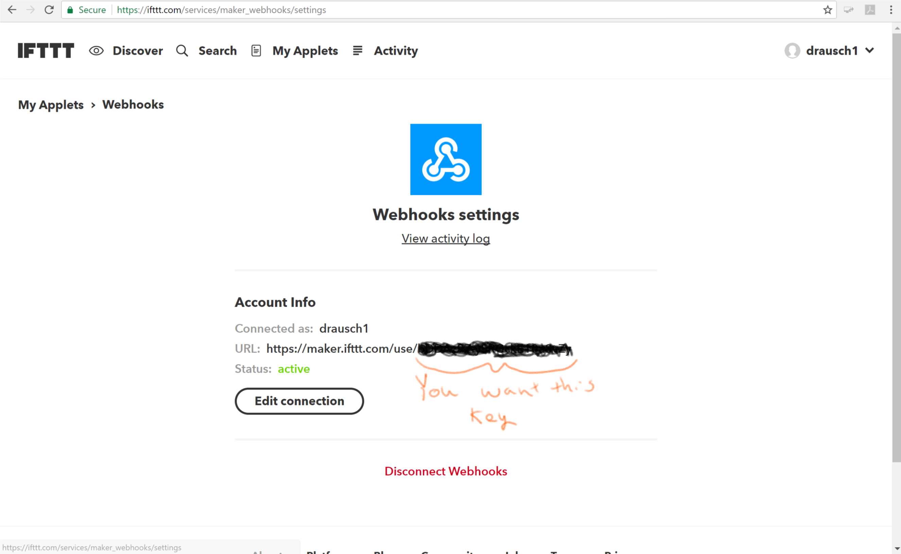

* Go back to the Node-Red tab in your browser and click field behind key.  Click __Add new ifttt-key...__ and then click the pencil behind the field.  Paste the key you just copied from IFTTT into the field.  Leave the Event Name field with the default event1.  You can change this to something more descriptive but remember what it is because we will need it later.  Click __Add__.


* Click __Done__.

### Step 7: Build an IFTTT Recipe
Your flow is now built and configured but we need to tell the IFTTT service what to do if it gets activated.  We do this through building an IFTTT recipe.

* Go back to your IFTTT browser tab.  If it got closed use the address https://ifttt.com/my_applets
* Click on __New Applet__

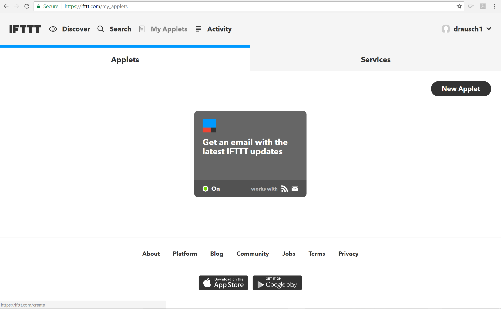

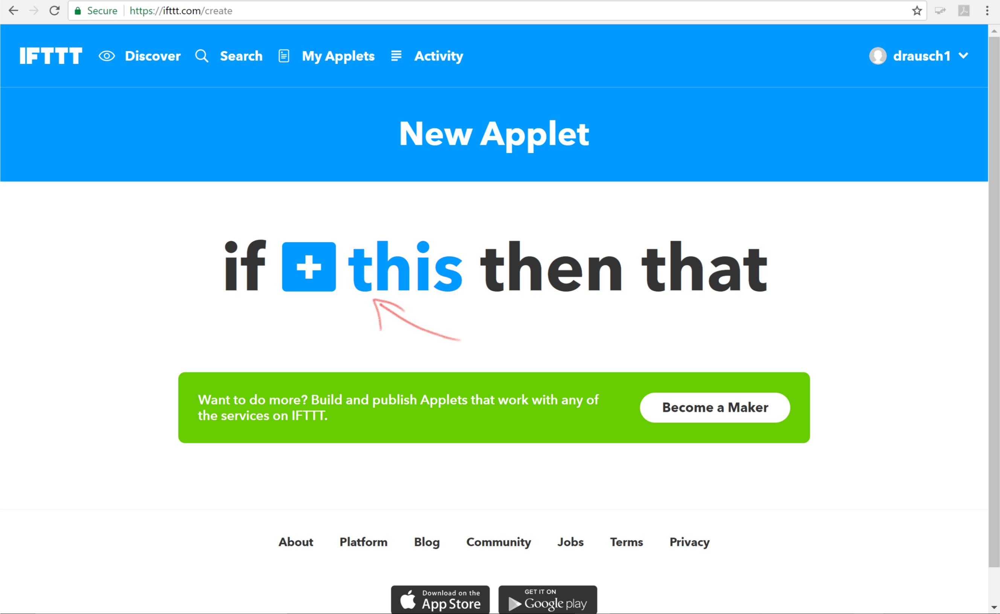

* In the _Choose a Service_ search field enter webhooks and select the webhooks service displayed

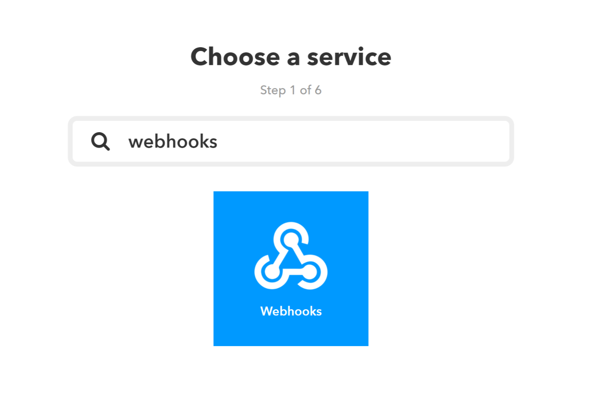

* On the choose a trigger screen select _Receive a web request_

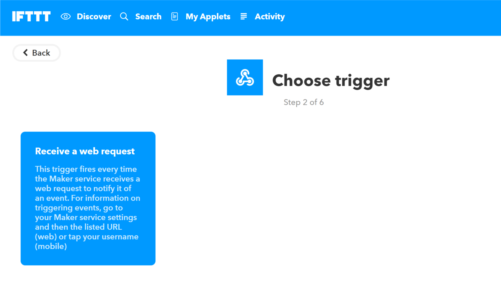

* In the Event Name field enter __event1__.  If you named your event something else in Node-Red you should enter that here.

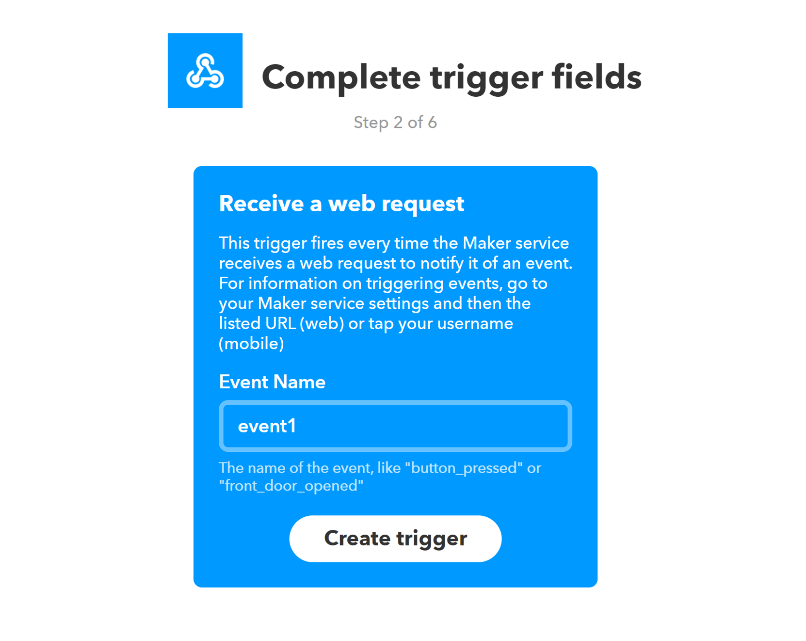

* Click __Create Trigger__

* You now get to tell IFTTT what it should do when it receives the trigger.  Take a moment to look through all the options.  We are going to send an email.  Click the email service tile.

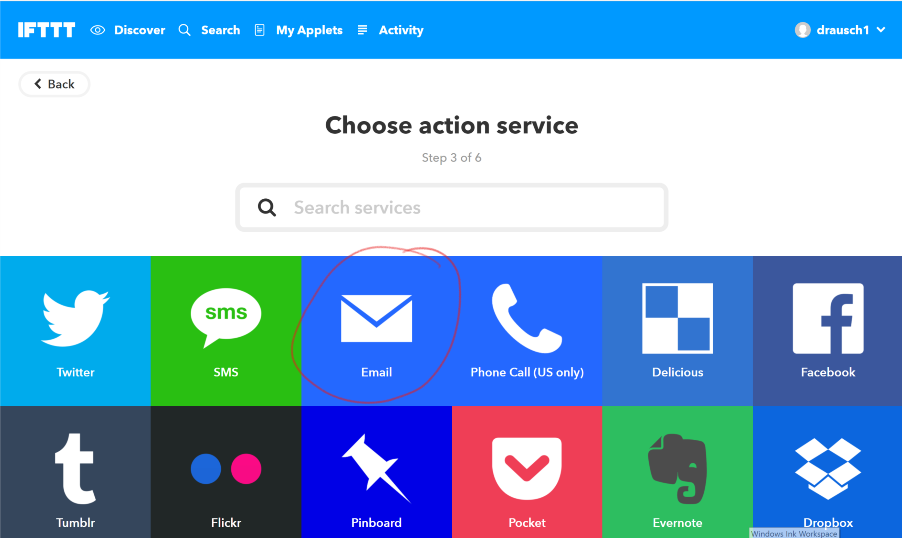

* You now have the opportunity to customize what the email will say when it is sent.  You can pass data between Node-red and IFTTT.  For now we will use the default values. This will send an email to the address you used to register when you created your IFTTT account. Click __Create Action__.

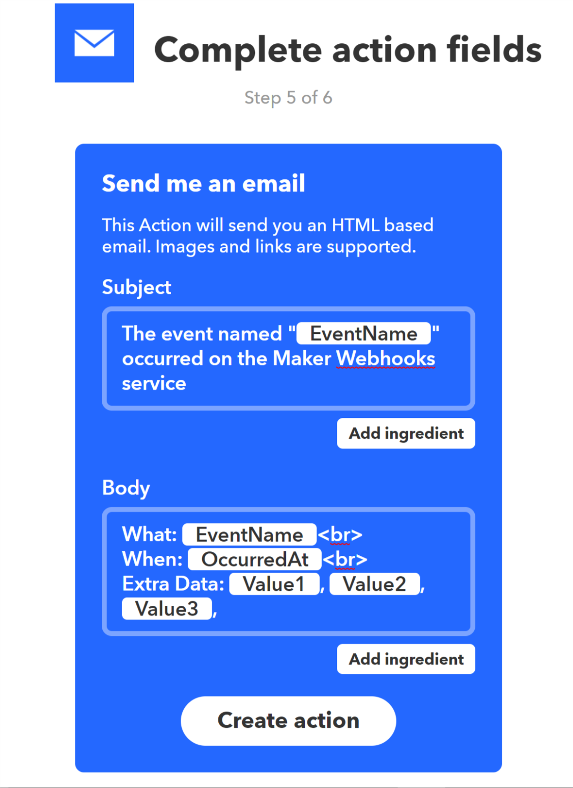

* Congratulations!  You have built your first recipe.  Click __Finish__

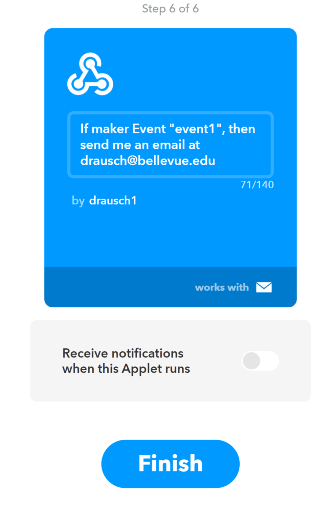

### Step 8: Test it!
We have now built our flow and the supporting recipe.  To test the flow we must first deploy it and then activate the timestamp node.

* Click the _Deploy_ button at the top right of the screen
* Click the button on the left side of the timestamp node

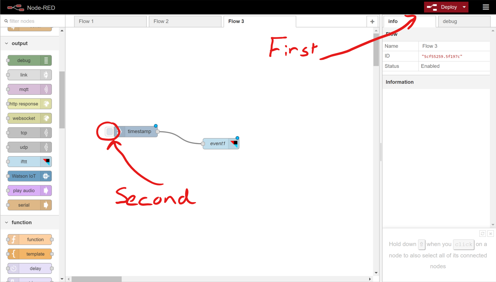

 If you did everything correctly you will receive an email telling you that the timestamp button was pressed.  Although this was very simple and perhaps not very useful think about what how this could be expanded.  Maybe instead of clicking the timestamp node the IFTTT is triggered by an external switch that activates whenever your pet goes out their pet door.  Now your pet will send you an email when it goes out into the yard!

### A Second Example

Let's try a second example that doesn't use the IFTTT service.  In this example we will build a new flow that swaps out the IFTTT node for a Camera node - remember that principle of __Modularization__?  Here it is in action.

### Step 1: Add a new flow
We will begin by adding a new flow, that way the one you created will still be active.

* Click the plus to the right of the flow names, this will open a new tab for your new flow.

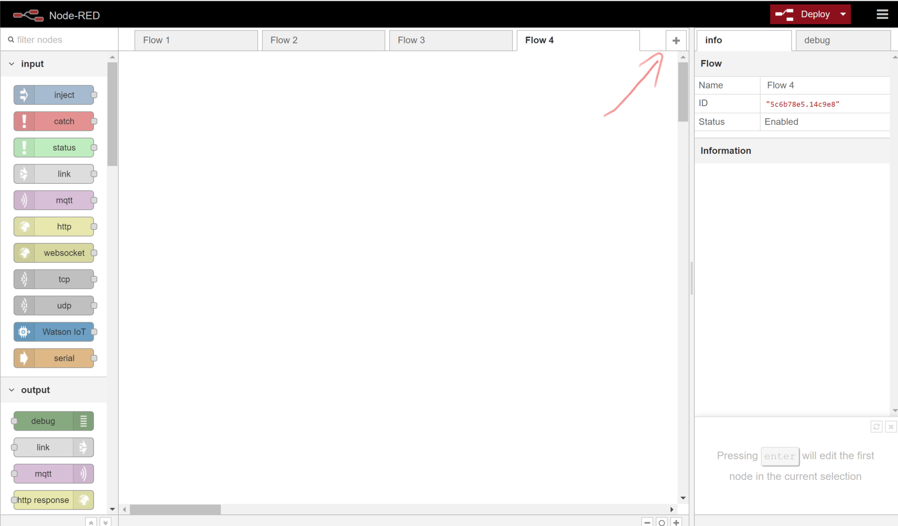

### Step 2: Build your new flow
You've already built one flow, this one will follow the same procedures.  Add an inject node, a camerapi node (under the Raspberry Pi section of the pallet), and connect them.  Your completed flow should look like the below.

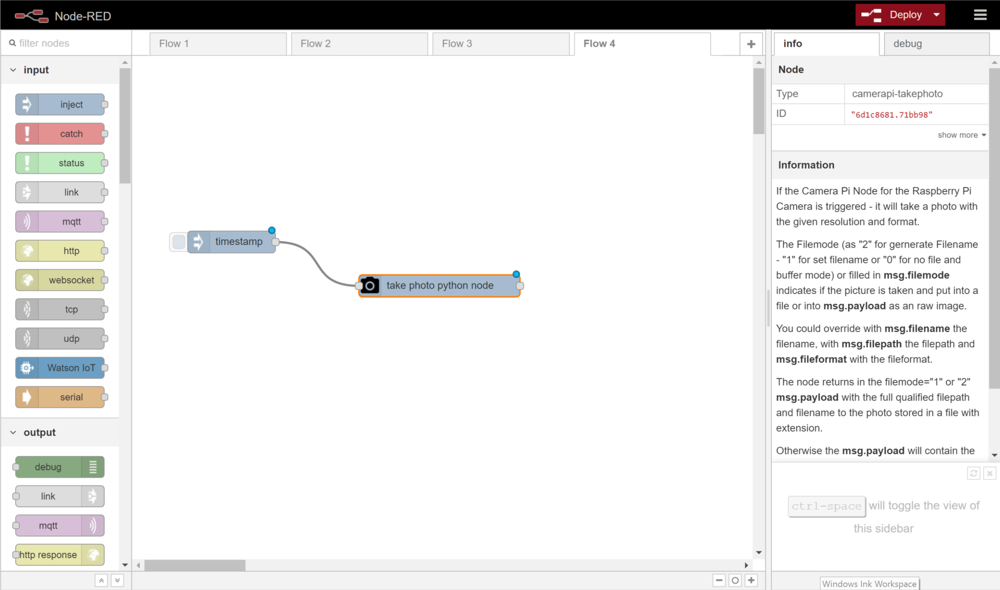

### Step 3: Test it!
We are going to use the default settings for the nodes for this flow.  The camera node, when activated, will take a photo with the Pi's camera, give the photo a unique (and very long) filename, and store it in the `/home/pi/pictures` directory.  You can configure the node to give custom file names, set picture formats and sizes and orientations.

* Deploy your new flow
* Click the timestamp inject button
* You can view the picture you just took by going to the Pi desktop, clicking _menu_, _accessories_, _file manager_.  Click the _pictures_ folder and double click your photo to view.

Discuss with the class how these features could be used in an IoT device.  Maybe the inject is triggered with a sound, takes a photo, and emails it to you - your own burglar alarm!

Spend some time exploring the Node-Red nodes.  What else could you build?

### Evaluation
Use Kahoot to assess comprehension
* Which cybersecurity first principle addresses how nodes can be replaced with other nodes in a flow to modify features? _Modularization_
* Which cybersecurity first principle addresses how you are unable to directly access the inner workings of a node but must set parameters through dialogs? _Resource Encapsulation_.
* Each node represents a single action however there may be several steps hidden in the background is an example of? _Abstraction_.
* An IFTTT program is called a what? _Recipe_.

### Additional Resources
For more information, investigate the following.

* [Node Red website](https://nodered.org/)

### Acknowledgements

### License
[Nebraska GenCyber](https://github.com/MLHale/nebraska-gencyber) <a rel="license" href="http://creativecommons.org/licenses/by-nc-sa/4.0/"></a><br /> is licensed under a <a rel="license" href="http://creativecommons.org/licenses/by-nc-sa/4.0/">Creative Commons Attribution-NonCommercial-ShareAlike 4.0 International License</a>.

Overall content: Copyright (C) 2017  [Dr. Matthew L. Hale](http://faculty.ist.unomaha.edu/mhale/), [Dr. Robin Gandhi](http://faculty.ist.unomaha.edu/rgandhi/), and [Doug Rausch](http://www.bellevue.edu/about/leadership/faculty/rausch-douglas).

Lesson content: Copyright (C) [Your name here](your site here) 2017.
<a rel="license" href="http://creativecommons.org/licenses/by-nc-sa/4.0/"></a><br /><span xmlns:dct="http://purl.org/dc/terms/" property="dct:title">This lesson</span> is licensed by the author under a <a rel="license" href="http://creativecommons.org/licenses/by-nc-sa/4.0/">Creative Commons Attribution-NonCommercial-ShareAlike 4.0 International License</a>.
