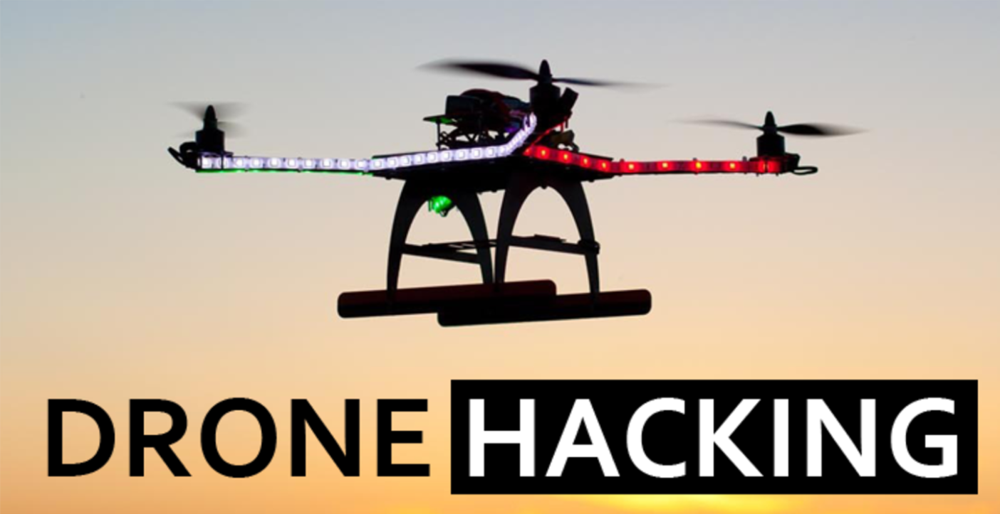
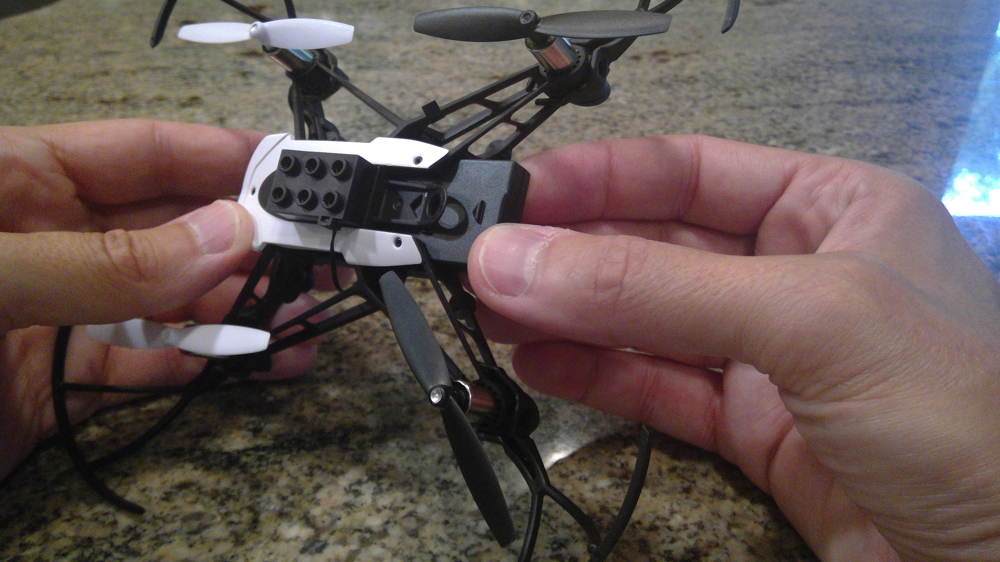
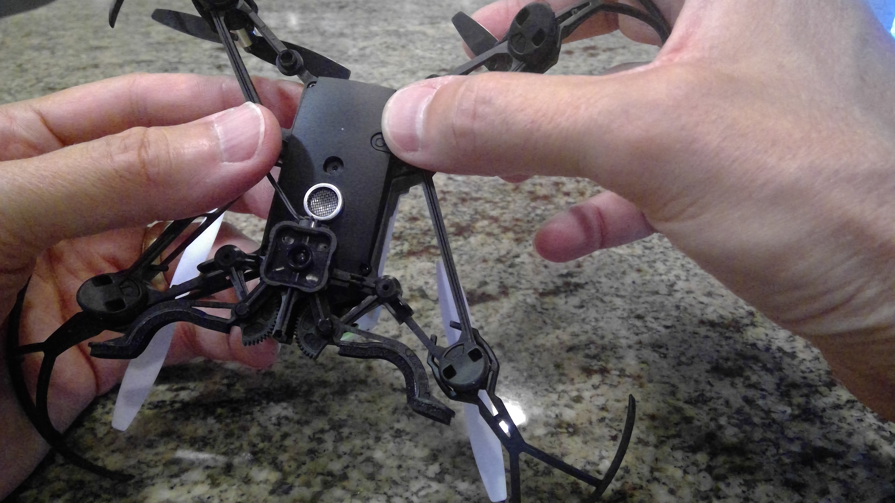
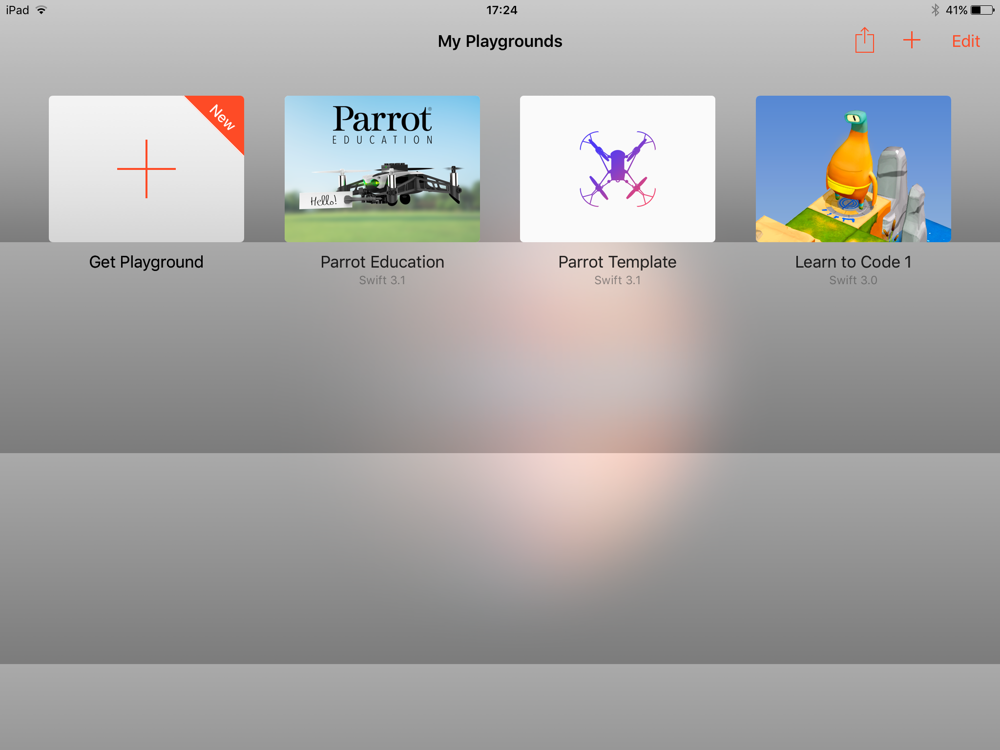
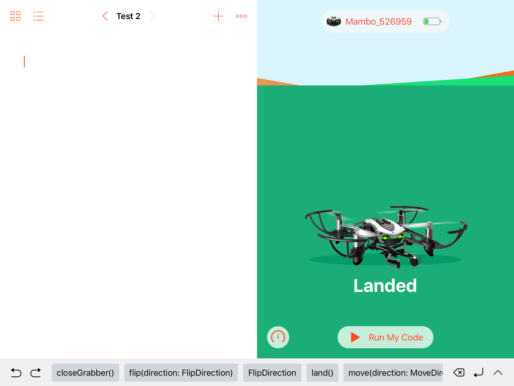
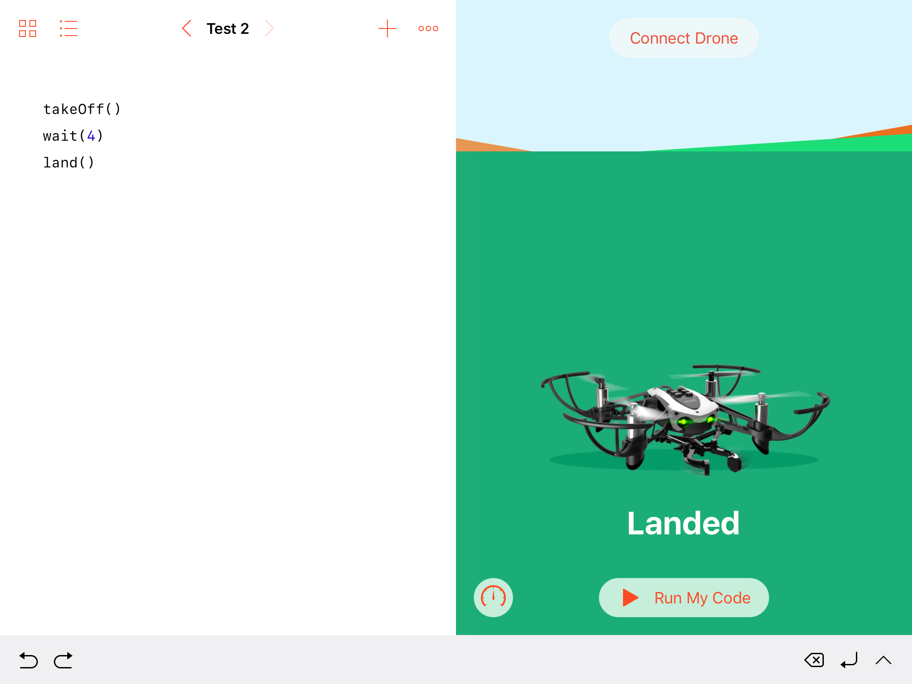
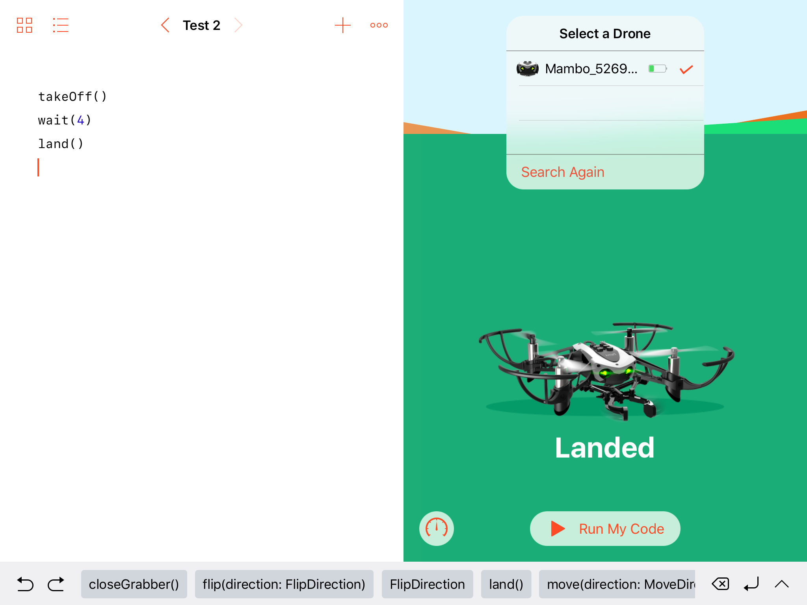

# Drone Programming

### Cybersecurity First Principles in this lesson

* __Abstraction__: An abstraction is a representation of an object or concept. It could be something
such as a door, a speedometer, or a data structure in computer science. Abstraction decouples the design from the implementation. The gauges in an automobile are an abstraction of the performance of a car. A map is an abstraction of the earth.

* __Data Hiding__: Data hiding is the technique that does not allow certain aspects of an object to be
observed or accessed. Data and information hiding keeps the programmer from having complete access to data structures. It allows access to only what is necessary.

* __Least Privilege__: One of the ways to protect information is by limiting what people can see and do with your information and resources. The principle of least privilege says to allow the minimum number of privileges necessary to accomplish the task.

* __Modularization__: The concept of modularity is like building blocks. Each block (or module) can be put in or taken out from a bigger project. Each module has its own separate function that is interchangeable with other modules.

* __Resource Encapsulation__: Encapsulation is an object oriented concept where all data and functions required
to use the resource are packaged into a single self-contained component. The goal is to only allow access or manipulation of the resource in the way the designer intended. An example, assume a flag pole is the object. There are fixed methods on how the flag pole is to be used. Put the flag on, take the flag off, raise or lower the flag. Nothing else can be done to the flag pole.

* __Simplicity__: Simplicity allows a person to better understand hardware and software. Without the clutter of unnecessarily complicated code and interfaces, the software will be more understandable by people that will update the code when requirements change. It will be easier to understand by the testers and they will be able to spot problems sooner. By keeping software as simple and as focused as possible, the reliability and security is greatly increased.

### Introduction

It seems like unmanned aircraft systems, more commonly called drones, are everywhere.  You see them at sporting events, entertainment venues, they are used for search and rescue, to survey disaster damage, even by farmers and ranchers to check on crops and herds.  We may even see them soon for package delivery.  We also hear a lot about safety flying drones, we don't want anyone to get hurt.  But what about cybersecurity?  Is that important with drones?  Could someone get hurt from a hacked drone?



### Goals

* Apply safe drone operating principles
* Utilize simple swift commands to command drones to complete an obstacle course
* Determine how application of cybersecurity first principles can increase the cybersecurity of drone operation

### Materials Required

* Parrot Mambo Drone (other Parrort drones can be used with Swift environment, check for updates)
* Apple iPad with Swift Playgrounds and Parrot templates
* Safety glasses
* Optional: extra batteries and charger

### Prerequisite lessons

* None

### Table of Contents
<!-- TOC START min:1 max:3 link:true update:true -->
- [Cybersecurity First Principles in this lesson](#cybersecurity-first-principles-in-this-lesson)
- [Introduction](#introduction)
- [Goals](#Goals)
- [Materials Required](#materials-required)
- [Prerequisite lessons](#prerequisite-lessons)
- [Step 1: Prepare drone for flight](#step-1-prepare-drone-for-flight)
- [Step 2: Start Swift Playgrounds on your iPad](#step-2-start-swift-playgrounds-on-your-iPad)
- [Step 3: Create your first program](#step-3-create-your-first-program)
- [Step 4: Connect your drone with your iPad](#step-4-connect-your-drone-with-your-iPad)
- [Step 5: Run your code](#step-5-run-your-code)
- [Step 6: Expand your capabilities](#step-6-expand-your-capabilities)
- [Additional Resources](#additional-resources)
- [Acknowledgements](#acknowledgements)
- [License](#license)

<!-- TOC END -->

### Before we begin - __Safety First__
The FAA has several rules for the operation of drones.  The below rules apply to flying for fun or educational purposes, if you are flying the drone for work (to make money) then there are more stringent rules which must be followed

* If the drone weighs over .55 lbs it must be registered with the FAA
* You cannot operate the drone within 5 miles of an airport without prior notification to airport and air traffic control
* You must yield the right of way to manned aircraft.

The drones we are using today are under .55 lbs and since we are flying indoors we do not have to worry about notifying airport authorities.  If you use a different drone or fly outdoors you should check the [FAA web site](https://www.faa.gov/uas) for any additional rules you should follow.

In addition to the above the below safety rules apply no matter what type of drone you are flying:

* Fly at or below 400 feet
* Be aware of airspace requirements and restrictions
* Stay away from surrounding obstacles
* Keep your drone within sight
* Never fly near other aircraft, especially near airports
* Never fly over groups of people
* Never fly over stadiums or sports events
* Never fly near emergency response efforts such as fires
* Never fly under the influence of drugs or alcohol

### Step 1: Prepare drone for flight
Using the provided battery you will get about 7 or 8 minutes flight time on a charge.  Having several batteries available will lengthen your operational time.

* Place fresh battery in drone



* Put on your safety glasses
* Turn on drone



* Place drone on flat service away from obstacles and your classmates

### Step 2: Start Swift Playgrounds on your iPad

* Open Swift Playgrounds on your iPad.  If the application is not loaded you will need to go to the iOS app store and download it before proceeding.



* You should see tiles for both Parrot Education and Parrot Template.  If you don't see one or both of these touch _Get Playground_ and load them.
* Touching the Parrot Education playground will take you through a guided lesson on the commands needed for controlling your drone.

We will go through an abbreviated introduction to the commands in this lesson.  The Parrot Education playground is a great resource for additional practice or as a stand-alone lesson.

### Step 3: Create your first program
It's time to create your first program.  Select the __Parrot Template__ playground.  You will see your programming environment similar to the below.



You will see the screen divided into two sections.  The left or top half the screen (depending on the iPad orientation) is where you will write your code.  At the top of this section you will see a name for the program you are working on as well as arrows to the left and right.  This allows you to cycle through programs on this template.  The right or bottom half is where you will see a simulation of the drone's activity.  The simulation is an example of the application of the First Principle of __Abstraction__.  It's a representation of the more complex drone's actions.

You can enter code by using a keyboard or by selecting the various commands at the bottom of the screen and providing the proper parameters.

Let's start with something simple, takeoff and land.  Enter the commands into the code window using the keyboard or by selecting the commands from the bottom of the screen.  Note that the commands are case sensitive.

```
takeOff()
wait(4)
Land
```

The commands are pretty self-explanatory.

* _takeOff()_ Tells the drone to take off, kind of what you would expect, right?
* _wait(4)_ Tells the drone to wait a number of seconds priot to going to the next command.
* _land()_ As you would expect, tells the drone to land.

Before we go farther let's talk for a moment about some Cybersecurity First Principles which apply here.  It requires many lines of code to make your drone take off and hover, maintaining stable flight.  It's checking multiple sensors and motor rotation. Those inputs change how power is applied to the motors.  But all you did was issue the command _takeOff()_.  This is an example of __data hiding__.  As a programmer you are limited from accessing directly all the data and commands that are needed for the command _takeOff()_ to work.

In general, the commands you use to control the drone, provide an example of __resource encapsulation__. The drone is an object, and there are only certain applicable operations, for example take off and land, which make sense for a drone.  There are many actions which make up those commands but by hiding those from the user your make the drone operations safer.  If you had direct access to the all the commands which made the drone operate there is a good chance you could cause some harm, either on purpose or by mistake.  By encapsulating the resources, in this case the commands which comprise, _takeOff()_ and _land()_, the user only has access to those commands which are applicable to the authorized operations.  If a user weren't limited by the __resource encapsulation__ of the command _takeOff()_ they could send commands to make half the drone take off and the other half land.  This could cause damage to the drone. There are also some commands which won't work under all conditions.  For example you can't do flips if the claw is attached as the drone's flight could become unstable. You are also not allowed to take off if the battery is too low.   __Resource encapsulation__ ensures that only those operations of the object which are appropriate at the time are allowed.   This is also a good example of the principle of __simplicity__.  A user doesn't need to know all the commands necessary to hover, they just tell the drone to take off.

Are there examples of how the principal of __least privilege__ could be applied to drone operations?

### Step 4: Connect your drone with your iPad
You will only need to do this step when first using your drone, or changing drones.

* Touch the __Connect Drone__ button at the top of the simulation window.



* Select your drone from the list.



### Step 5: Run your code
We are finally ready to fly your drone with your first program.

* Make sure you have your safety glasses on, your drone is on a flat surface and the area is clear
* Touch __Run My Code__ at the bottom of your simulation window.

Hopefully you have been treated to a brief aerial demonstration by your drone.  If not check the code against the list above, pay attention to spelling and case.

### Step 6: Expand your capabilities
Believe it or not you already know most of what you need to write longer and more complex programs for drone operations.  There are several other commands you can use to perform different maneuvers.  Use the below as a references and add them as needed to your drone program.

* _closeGrabber()_: Close the grabber
* _flip(direction: FlipDirection.back)_: The drone will flip in the indicated direction.  Direction can be front, back, left, right.  You can not do flips if the grabber is installed
* _land()_: The drone will land
* _move(direction: MoveDirection.left, duration: 3)_: The drone will move in the indicated direction for the given number of seconds.  In this example the drone will move left for 3 seconds.  Other directions are right, up, down, forward, backward.  Moving left/right is called roll.  Moving forward/backward is called pitch.  Moving up/down is called gaz.
* _move(direction: MoveDirection.left)_: The same as the previous command except there is no duration statement.  The drone will just keep moving until it is told to do something different.
* _stopMoving()_: Tells the drone to stop moving
* _move(pitch:20, roll:20, gaz:10, yaw:180, duration:3)_: Allows moves around multiple axis at the same time.  Every parameter defines the move speed on its axis, and the rotation speed.  The drone will move in all specified directions at the same time.
* _openGrabber()_: Open the grabber
* _takeOff()_:  Drone will take off and hover a short distance above the ground
* _takePicture()_: The drone will take a picture with its downward facing camera.  You can download the picture with the drones app or via usb cable.
* _turn(direction: TurnDirection.left, angle: 90)_: Turn the drone left (counterclockwise), for 90 degrees).  The drone can also turn right (clockwise).  Turning left/righ is call yaw.
* _wait(4)_:  Drone will wait a number of seconds before executing the next command.  In this example it will wait 4 seconds
* _droneSpeed=50_: Changes the speed of the drone.  50 is 50% of maximum speed.  100 would be 100% of maximum speed.

You can also create functions to group several commands and call them where needed.  This is an example of the cybersecurity first principle of __Modularity__.  Functions are the building blocks of larger programs and you can add, remove, and move around functions to change operations as needed.

You now have all the basics you need to program some complex drone operations.  Good luck and have fun!

### Postal Challenge  


### Additional Resources
For more information, investigate the following.

* [Parrot Education](http://edu.parrot.com/) - Education resources for parrot drones

### Acknowledgements


### License
[Nebraska GenCyber](https://github.com/MLHale/nebraska-gencyber) <a rel="license" href="http://creativecommons.org/licenses/by-nc-sa/4.0/"></a><br /> is licensed under a <a rel="license" href="http://creativecommons.org/licenses/by-nc-sa/4.0/">Creative Commons Attribution-NonCommercial-ShareAlike 4.0 International License</a>.

Overall content: Copyright (C) 2017  [Dr. Matthew L. Hale](http://faculty.ist.unomaha.edu/mhale/), [Dr. Robin Gandhi](http://faculty.ist.unomaha.edu/rgandhi/), and [Doug Rausch](http://www.bellevue.edu/about/leadership/faculty/rausch-douglas).

Lesson content: Copyright (C) [Your name here](your site here) 2017.
<a rel="license" href="http://creativecommons.org/licenses/by-nc-sa/4.0/"></a><br /><span xmlns:dct="http://purl.org/dc/terms/" property="dct:title">This lesson</span> is licensed by the author under a <a rel="license" href="http://creativecommons.org/licenses/by-nc-sa/4.0/">Creative Commons Attribution-NonCommercial-ShareAlike 4.0 International License</a>.
