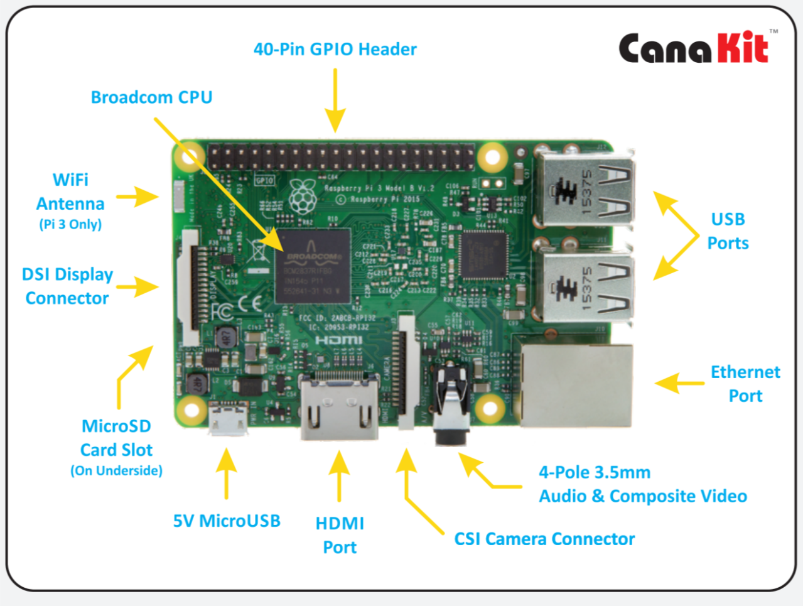
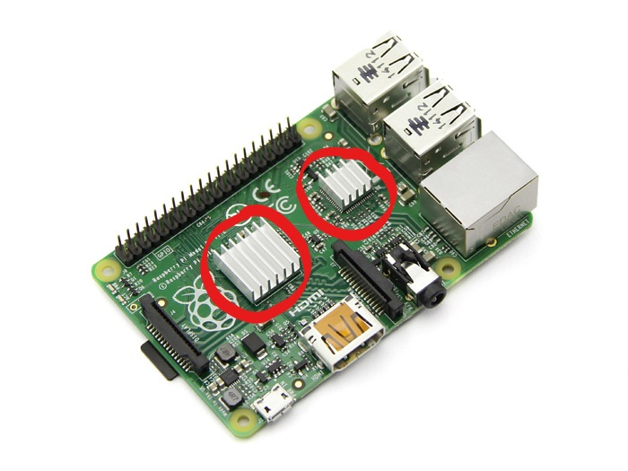
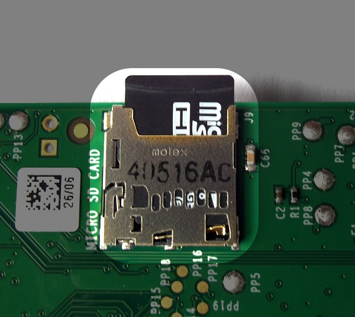
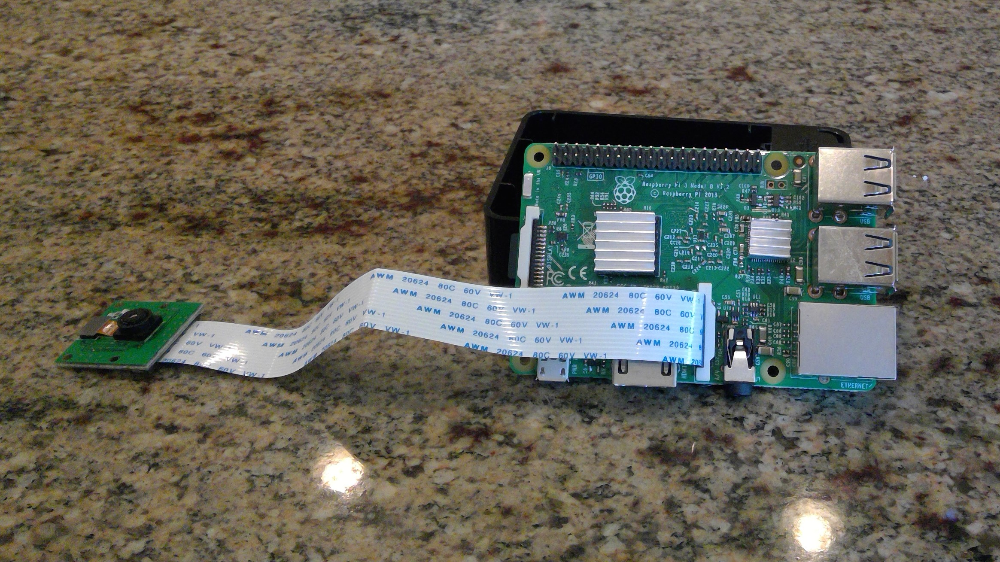
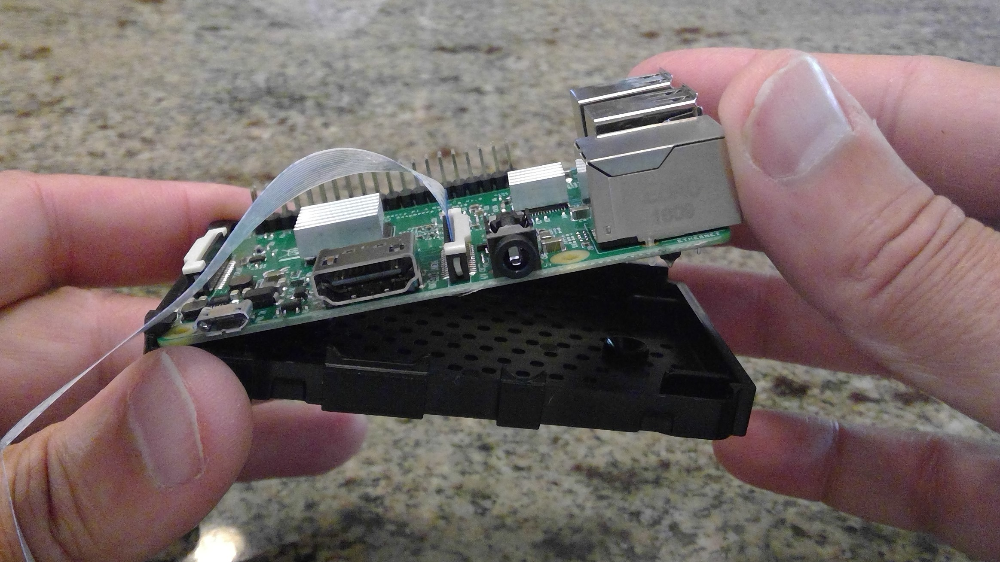
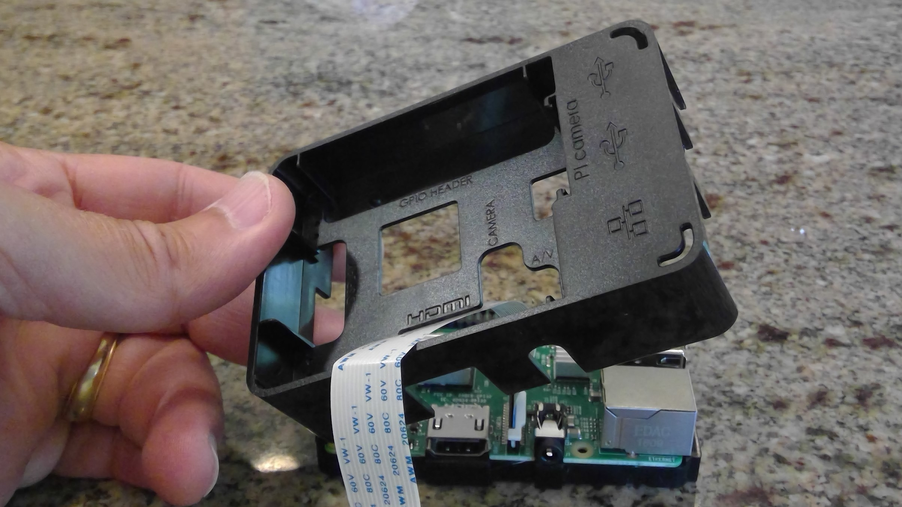
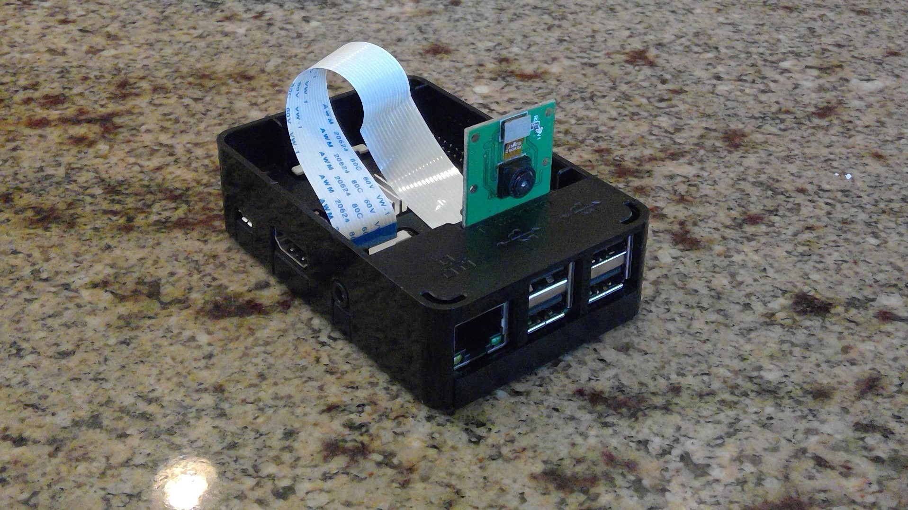
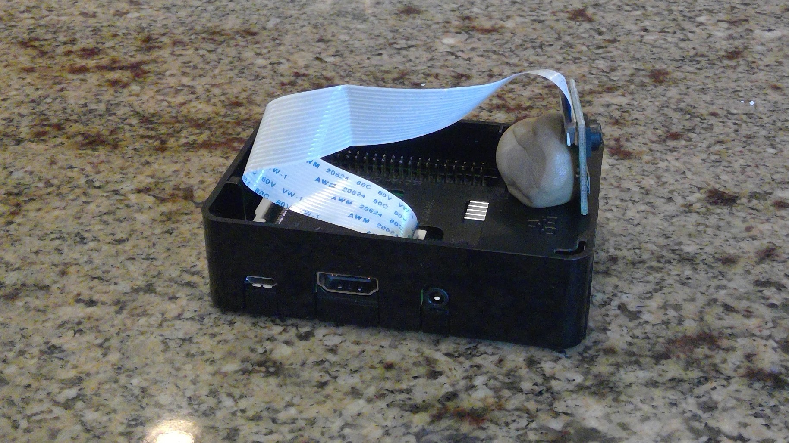
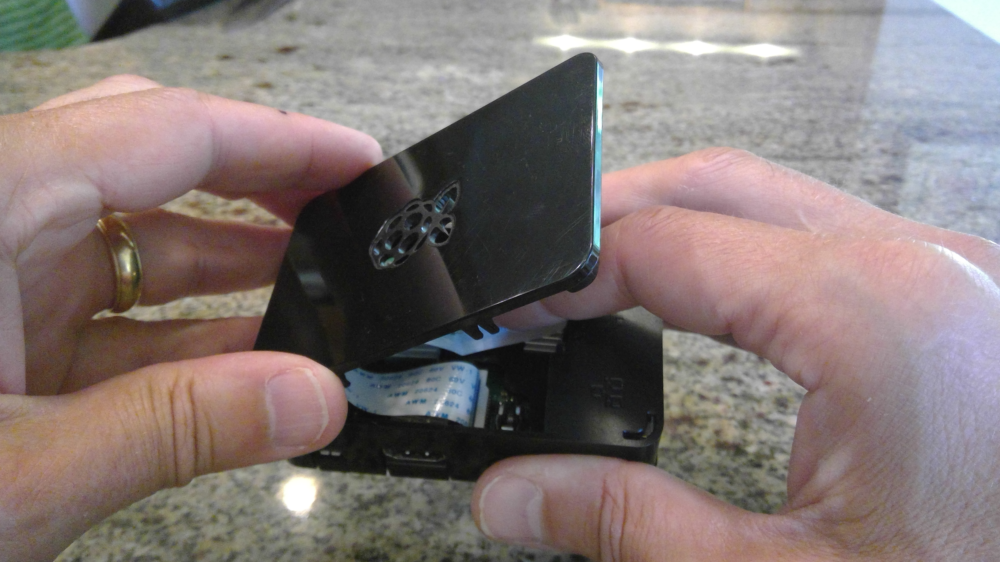
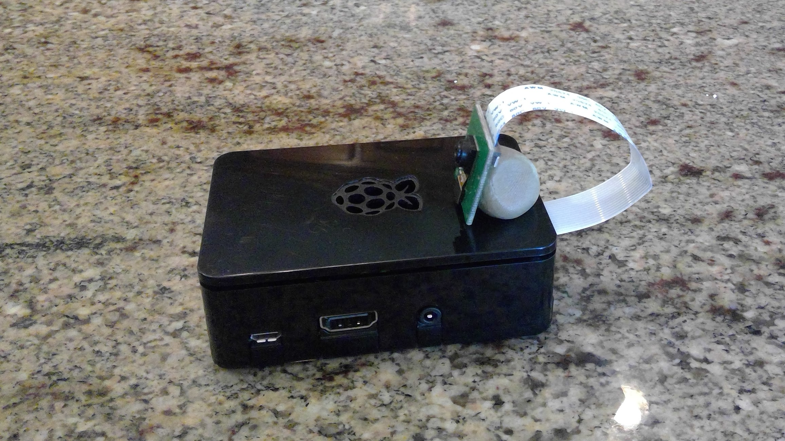

# Introduction to Raspberry PI
### Cybersecurity First Principles in this lesson

* __Abstraction__: An abstraction is a representation of an object or concept. It could be something
such as a door, a speedometer, or a data structure in computer science. Abstraction decouples the design from the implementation. The gauges in an automobile are an abstraction of the performance of a car. A map is an abstraction of the earth.

* __Least Privilege__: One of the ways to protect information is by limiting what people can see and do with your information and resources. The principle of least privilege says to allow the minimum number of privileges necessary to accomplish the task.

* __Modularization__: The concept of modularity is like building blocks. Each block (or module) can be put in or taken out from a bigger project. Each module has its own separate function that is interchangeable with other modules.

### Introduction
This lesson will introduce students to the Raspberry Pi platform, discuss it’s components and how they related to the Cybersecurity First Principles.  Students will demonstrate their understanding of the component relationships by building a Raspberry Pi from a kit, booting it up, and installing updates.  The Raspberry Pi will be the student’s primary computer for developing their own Internet of Things (IoT) app.

### Goals
By the end of this lesson students will be able to
*	Assemble a Raspberry Pi
*	Identify key components of the Raspberry Pi
*	Apply the Cybersecurity First Principles of modularity, abstraction, and least privilege to the Raspberry Pi platform

### Materials Required
*	Raspberry Pi kit (pi, case, sd card, heat sinks, power cable, hdmi cable)
*	DVI to hdmi converter
*	Keyboard
*	Mouse
*	Quick Start Guide
*	Optional: Internet connection to complete updates
*	Optional: Raspberry pi camera and poster putty

### Prerequisite Lessons
*	None

### Table of Contents
<!-- TOC START min:1 max:3 link:true update:true -->
- [Cybersecurity First Principles in this lesson](#cybersecurity-first-principles-in-this-lesson)
- [Introduction](#introduction)
- [Goals](#Goals)
- [Materials Required](#materials-required)
- [Prerequisite lessons](#prerequisite-lessons)
- [Step 1: Distribute the Raspberry Pi kit and other materials](#step-1-distribute-the-raspberry-pi-kit-and-other-materials)
- [Step 2: Unbox the Raspberry Pi](#step-2-unbox-the-raspberry-pi)
- [Step 3: Install the heat sinks](#step-3-install-the-heat-sinks)
- [Step 4: Install the mini SD card into the Raspberry Pi](#step-4-install-the-mini-SD-card-into-the-raspberry-pi)
- [Step 5: Install the Raspberry Pi camera](#step-5-install-the-raspberry-pi-camera)
- [Step 6: Install the Raspberry Pi into the case](#step-6-install-the-raspberry-pi-into-the-case)
- [Step 7: Install the keyboard and mouse](#step-7-install-the-keyboard-and-mouse)
- [Step 8: Install the hdmi cable](#step-8-install-the-hdmi-cable)
- [Step 9: The moment you have been waiting for - turn on the Raspberry Pi!](#step-9-the-moment-you-have-been-waiting-for-turn-on-the-raspberry-pi!)
- [Step 10: Updating the Raspberry Pi software](#step-10-updating-the-raspberry-pi-software)
- [Step 11: Shutdown the Raspberry Pi](#step-11-shutdown-the-raspberry-pi)
- [Additional Resources](#additional-resources)
- [Acknowledgements](#acknowledgements)
- [License](#license)

<!-- TOC END -->

### Step 1: Distribute the Raspberry Pi kit and other materials
The Raspberry Pi kit goes together very quickly, the main thing to remember is to ensure each student has ample room to spread out their parts and work.  Some of the parts are small and once the students get started it often looks like Christmas morning with boxes and packing paper being flung everywhere.  What tends to work well is to only unbox what is needed, as it’s needed, explain the part, and install it, lockstep for the whole class making sure everyone is caught up before moving on.

### Step 2: Unbox the Raspberry Pi
Have the students unbox the raspberry pi and identify/discuss with them the various components shown on the diagram below:



* GPIO: General Purpose Input/Output, this is where you can interface various projects to the Pi
* USB Ports: Pretty much any USB device can go here, we will use for keyboard and mouse
* Ethernet Port: Connection for a wireless network
* Audio and composite video: Audio output for speakers or headphones and composite video
* Camera Connector: Add a camera here to take pictures
* HDMI port: High definition video output
* 5V Micro USB: Your power cable will go here
* Micro SD card slot: The Pi uses micro SD cards store the operating system, applications and user data
* Display Connector: An optional display port, we will not use
* Wifi antenna: For communicating with a wifi access point
* Broadcom CPU: This is the brains of the Pi, it makes everything work together

This is an example of __modularity__. The raspberry pi board has several components, each doing a specialized function.  You will later add components such as a camera, keyboard, mouse, and power supply.  At a higher level the Raspberry Pi is a modular component in and of itself, fitting into a larger IoT application.  The principle of __Abstraction__ also applies here as the Raspberry Pi itself is an abstraction of all the supporting components doing the input/output/storage and processing functions.

### Step 3: Install the heat sinks
Remove the backing paper from the heat sinks and stick to the chips as shown in the picture below.  The heat sinks look like silver plates with fins off the top.  Heat sinks will help keep the chips below them cool by spreading the chips heat out over a larger area and exposing it to more air.



### Step 4: Install the mini SD card into the Raspberry Pi
The mini SD card holds both the operating system for the Raspberry Pi (which is a version of Linux) as well as any installed applications and user data.  Due to its small size and accessibility it is possible to have multiple SD cards with different operating systems and applications loaded.  Simply removing the SD card and replacing with a different one can give the user a completely new computer environment.  This is another example of the __modularity__ principle.

* Insert the SD card as shown in the diagram below, _Note the direction of the printing on the card_



### Step 5: Install the Raspberry Pi camera
The camera provides the ability for the Raspberry Pi to take photos and video.  This is another example of modularity.  The camera provides a special capability not native to the Pi, cutting down the cost of the basic Pi.

* The camera is connected to the Raspberry Pi by connecting its ribbon cable to the camera connector port between the audio connector and the hdmi port
* Follow the instructions which come with the camera to connect the ribbon cable.



### Step 6: Install the Raspberry Pi into the case
The case provides protection for the Raspberry Pi.  It comes in three parts.  If you are actively using the camera or GPIO ports the cover can be left off
* Insert the Pi into the case base, starting by aligning the SD card with the matching opening



* Place the case middle collar over the base, passing the camera through the appropriate opening and aligning and snapping in the tabs



You have a couple options for mounting your camera for use:
* Depending on the case and camera the camera may slip into the camera tabs on the ring of the case but don’t force it. Some camera boards are too thick to fit.



* Another option is to use poster putty as shown below to mount and point the camera.



* If you are not using the GPIO pins or the camera, place the camera flat on the Pi and place the cover on the collar



* You also have the option to pass the camera ribbon cable between the cover and the ring of the case and mount the camera on top of the case with poster putty.



### Step 7: Install the keyboard and mouse
* Plug the keyboard into a free USB port
* Plug the mouse into a free USB port

### Step 8: Install the hdmi cable
*	Plug one end of the hdmi cable into the hdmi port on the pi (refer to step 2 if you forget where that is)
*	If you monitor has a hdmi port then plug the free end of the hdmi cable into your monitor
*	If your monitor doesn’t have a hdmi port but has a DVI port then plug the free end of the hdmi cable into the DVI to hdmi converter and attach the DVI converter to your computer monitor

### Step 9: The moment you have been waiting for - turn on the Raspberry Pi!
*	Turn on your computer monitor
* Plug the small end of the power cable into the Raspberry Pi
*	Plug the other end of the power cable into a power strip or wall socket

### Step 10: Configuring the camera and updating the Raspberry Pi software
Now we need to tell the Raspberry Pi that you have installed a camera.  

* Use the Menu dropdown to select _Preferences_, and _Raspberry Pi Configuration_
* Select the _Interfaces_ tab
* Select _Camera Enable_, click OK, and confirm reboot

Even though you just assembled a brand new Raspberry Pi it’s a good idea to update the software on the system.  It's very common that security updates or new application capabilities may have been recently developed that are not yet installed.
*	The default Raspberry Pi user is _pi_ and default password is _raspberry_
*	In its default configuration the Raspberry Pi logs in the user automatically, for now we will leave this configuration in place
* Start by opening a terminal window by clicking the terminal icon at the top of the screen as shown below.


*	Enter the following command
```bash
apt-get update
```
You will notice you get an error message, that is because installing or updating software requires administrative privileges.  Although the user _pi_ is an administrator the Raspberry Pi enforces the first principle of __Least Privilege__ which says a user should have no more privileges than what is needed to do their job.  Generally you do not need administrator privileges to use the raspberry pi so by default they are not provided.  We need to tell the pi we want to use administrative privileges by using the command _sudo_, think of this command as super user do.  By proceeding a command with the command sudo we are telling the system to execute that program as an administrator or super user.  If the user is not an approved administrator this command will fail.

```bash
sudo apt-get update
```

Apt-get is the Linux program used to install and update software.  The option update tells the operating system to download the most recent list of available software.  Now enter the following

```bash
sudo apt-get upgrade
```

* Hit enter to answer yes to the question do you want to continue

The upgrade options to apt-get tells the operating system to compare the current software against the new catalog you just downloaded with the update command.  Any software that has a newer version is now downloaded and installed

### Step 11: Shutdown the Raspberry Pi
Now that the software has been updated we are done with the Raspberry Pi for now and can turn it off.  We could do this through the GUI with the mouse but we already have a terminal window open, here’s a command to turn off the Raspberry Pi off from the command line

```bash
shutdown now
```

### Evaluation
Use Kahoot to assess comprehension:
* A Raspberry pi uses modularity because: _it uses separate components for many of its functions.  Some like the camera can be installed and removed as needed being replaced with any other similar camera module_
* The Linux command sudo demonstrates which cybersecurity first principle: _least privilege_
* Which component of the raspberry pi stores the operating system: _SD card_

Discuss to ensure all understand the material.

### Additional Resources
For more information, investigate the following.

* [CanaKit Pi Quick Start Guide](http://www.canakit.com/Media/CanaKit-Raspberry-Pi-Quick-Start-Guide-2.1.pdf)

### Acknowledgements

### License
[Nebraska GenCyber](https://github.com/MLHale/nebraska-gencyber) <a rel="license" href="http://creativecommons.org/licenses/by-nc-sa/4.0/"></a><br /> is licensed under a <a rel="license" href="http://creativecommons.org/licenses/by-nc-sa/4.0/">Creative Commons Attribution-NonCommercial-ShareAlike 4.0 International License</a>.

Overall content: Copyright (C) 2017  [Dr. Matthew L. Hale](http://faculty.ist.unomaha.edu/mhale/), [Dr. Robin Gandhi](http://faculty.ist.unomaha.edu/rgandhi/), and [Doug Rausch](http://www.bellevue.edu/about/leadership/faculty/rausch-douglas).
