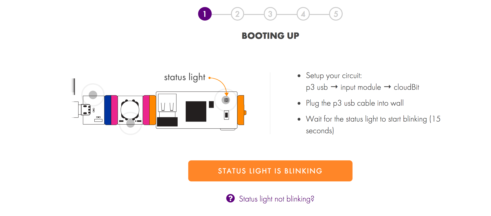
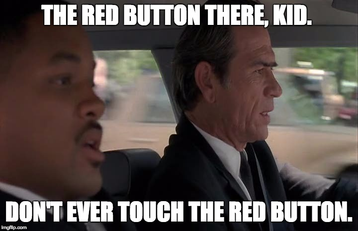
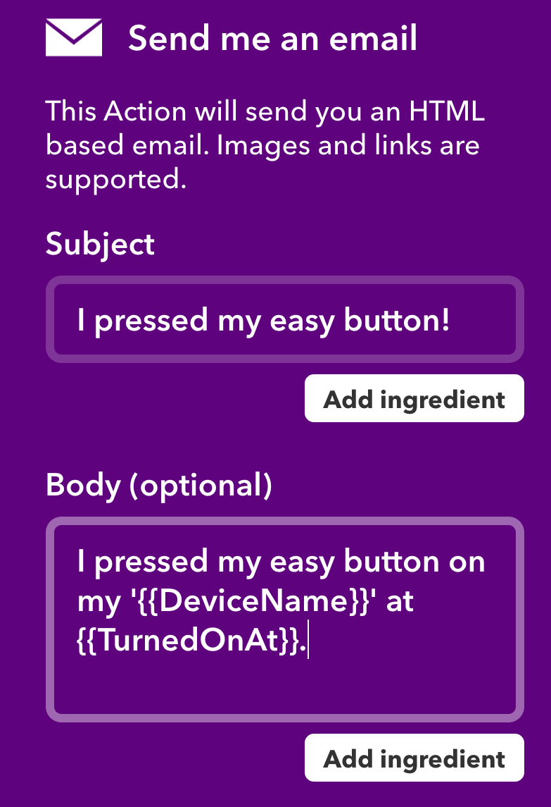
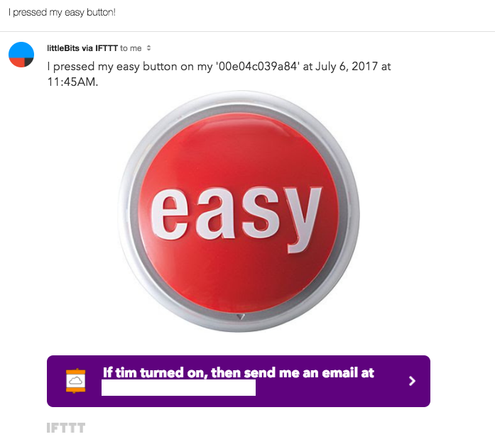
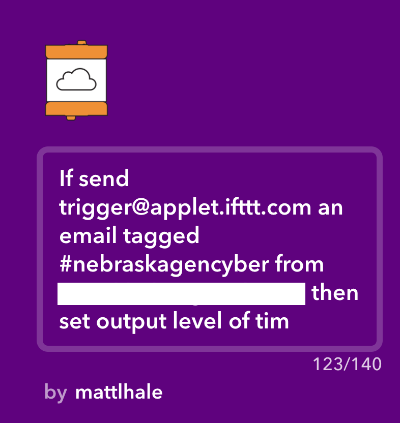
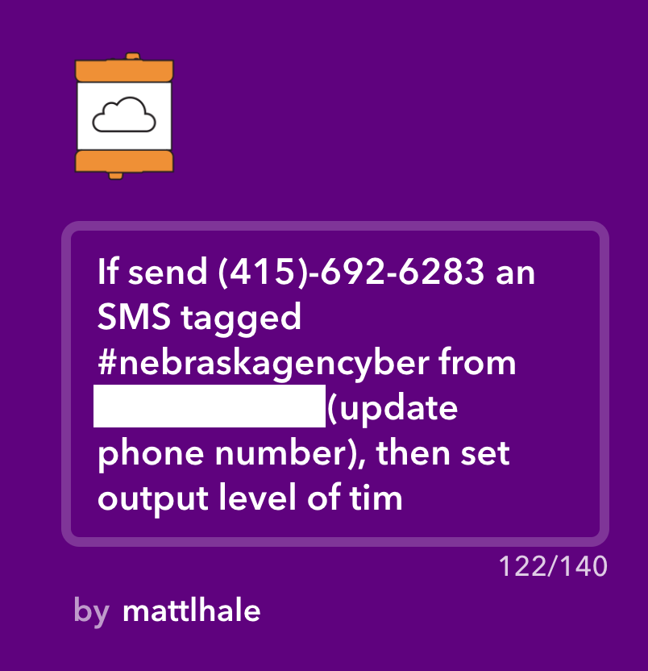
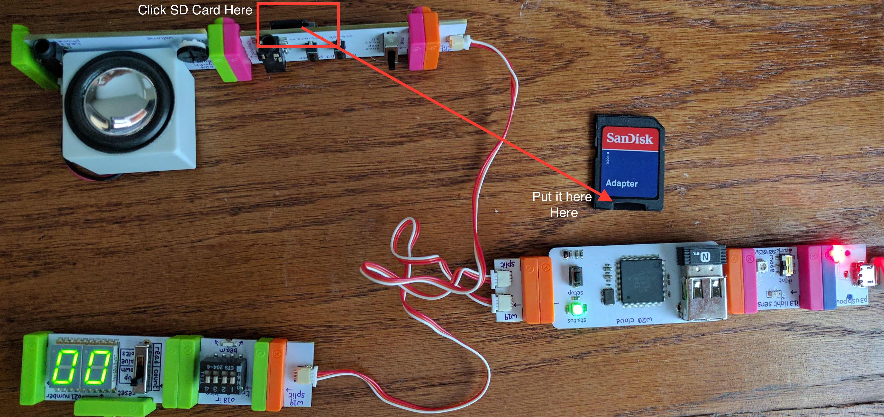
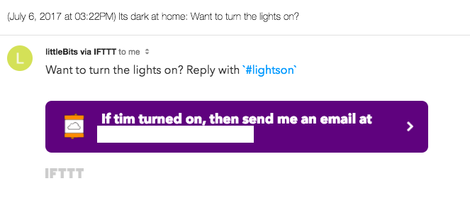
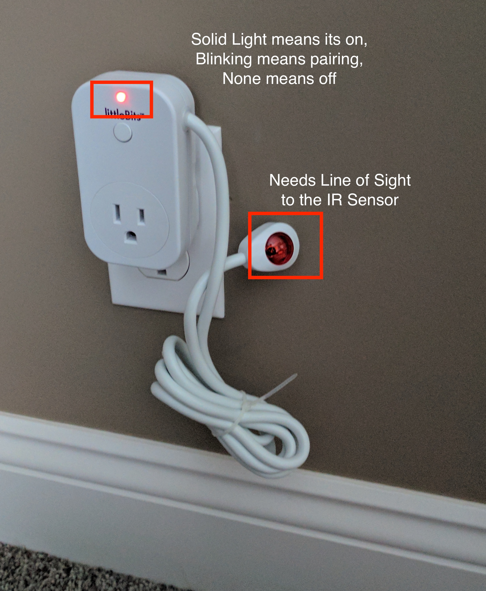

# Hands-on IoT: Littlebits IFTTT
### Cybersecurity First Principles in this lesson

* __Abstraction__: An abstraction is a representation of an object or concept. It could be something
such as a door, a speedometer, or a data structure in computer science. Abstraction decouples the design from the implementation. The gauges in an automobile are an abstraction of the performance of the car. A map is an abstraction of the earth.

* __Modularization__: The concept of modularity is like building blocks. Each block (or module) can be put in or taken out from a bigger project. Each module has its own separate function that is interchangeable with other modules.

* __Resource Encapsulation__: Encapsulation is an object oriented concept where all data and functions required
to use the resource are packaged into a single self-contained component. The goal is to only allow access or manipulation of the resource in the way the designer intended. An example, assume a flag pole is the object. There are fixed methods on how the flag pole is to be used. Put the flag on, take the flag off, raise or lower the flag. Nothing else can be done to the flag pole.

* __Data Hiding__: Data hiding is the technique that does not allow certain aspects of an object to be
observed or accessed. Data and information hiding keeps the programmer from having complete access to data structures. It allows access to only what is necessary.

* __Minimization__: Minimization refers to having the least functionality necessary in a program or device. The goal of minimization is to simplify and decrease the number of ways that software can be exploited. This can include **turning off ports that are not needed**, reducing the amount of code running on a machine, and/or turning off unneeded features in an application. This lesson focuses specifically on turning off ports that aren't in use.

### Introduction and goals
In this lesson we will explore a cool hands-on technology called [Littlebits](http://littlebits.cc/). Littlebits, follows a _component-based design_ paradigm using _GPIO_ (or general purpose input/output) to let you easily make apps. We will learn how to plug and play bits together to make some simple inventions. Littlebits will be the central platform for the rest of camp and you will be using them in other lessons.

### Goals
By the end of this tutorial, you will be able to:
* Interact with `web services`
* `Mashup` web services with Littlebits
* Make some apps that help automate your home

### Materials Required

* Littlebits kit
* Power outlet nearby
* Wi-Fi Internet Connection

### Prerequisite lessons
[Littlebits Intro](../hands-on-iot-little-bits-intro/README.md)

### Table of Contents
<!-- TOC START min:1 max:3 link:true update:true -->
- [Hands-on IoT: Littlebits IFTTT](#hands-on-iot-littlebits-ifttt)
    - [Cybersecurity First Principles in this lesson](#cybersecurity-first-principles-in-this-lesson)
    - [Introduction](#introduction)
    - [Materials Required](#materials-required)
    - [Prerequisite lessons](#prerequisite-lessons)
    - [Table of Contents](#table-of-contents)
    - [Before We Start](#before-we-start)
    - [Step 1: Create an Account / Login to Littlebits portal!](#step-1-create-an-account--login-to-littlebits-portal)
    - [Step 2: Pair your Cloudbit with the portal](#step-2-pair-your-cloudbit-with-the-portal)
    - [Step 3: ~~Don't Push~~ Push the ~~Red~~ Purple Button](#step-3-dont-push-push-the-red-purple-button)
    - [Step 4: Using web services - connecting to IFTTT](#step-4-using-web-services---connecting-to-ifttt)
    - [Step 5: Web Service Wizardry - Make an Easy Button](#step-5-web-service-wizardry---make-an-easy-button)
    - [Step 6: Email / SMS trigger](#step-6-email--sms-trigger)
    - [Step 7: Twitter watcher](#step-7-twitter-watcher)
    - [Step 8: Control your world](#step-8-control-your-world)
    - [Self Exploration](#self-exploration)
    - [Test you Bits, err... Wits!](#test-you-bits-err-wits)
    - [Additional Resources](#additional-resources)
    - [Acknowledgements](#acknowledgements)
    - [License](#license)

<!-- TOC END -->
### Before We Start
In the [last lesson](../hands-on-iot-little-bits-intro/README.md), you saw how versatile, modular, and cool Littlebits was to work with. It was easy to plug and play different modules together following simple `design patterns` to make cool, simple, apps. Now, imagine everything you saw before can be hooked up to the internet and **controlled using a smartphone or online app**. We are going to do _THAT_ now!

### Step 1: Create an Account / Login to Littlebits portal!
To start we need to create an account:

* Visit https://littlebits.cc/login and click `register`
* Walk through the online instructions to create your account

### Step 2: Pair your Cloudbit with the portal

Now that we have an account, we need to pair our `cloudbit` (an orange module with `cloud` written on it) with the `Littlebits Cloud Platform`. To do that:

* Login at http://control.littlebitscloud.cc/ using your account info.
* Give your new `cloudbit` a name: I decided to call mine "Tim".

 

* Follow the on-screen instructions to setup your `cloudbit`.

 

* First, connect the blue `power` module to the pink `button` module.
* Next, connect the `button` module to the orange `cloudbit` module.
* Then, connect the `bright led` module to the `cloudbit` module.
* It should all be connected as shown:


* Hold down the setup button on the `CloudBit` until the light blinks blue.  
* When the light blinks, let go and wait for the light to turn a steady blue.
* Using Wi-Fi, connect to the local Wi-Fi network the device broadcasts (it will be something like `litteBits_Cloud_somenumber`).
* Once connected to the device's Wi-Fi adapter, pick the Wi-Fi network the `cloudbit` will live on. (At UNO that will be: `UNOGuest`).
* It should auto-connect and the light should turn a solid green color.
* You should see as message saying **'Awesome'**


### Step 3: ~~Don't Push~~ Push the ~~Red~~ Purple Button


The purple button on your screen is linked to your `cloudbit` `output`.

* Add a green `bright LED` output module to the `cloudbit`.
* Now definitely press the giant purple `button` on your screen.

It works! With that you just made your first `IoT app`.

* The control portal will also now have you press the `button` on the `button` module.

You should see your gauge go up! Now you have input and outputs routed through the cloud controller!

### Step 4: Using web services - connecting to IFTTT
`Web services` are, as the name implies, services that live on the web. You use these all the time - mostly without knowing it. The internet is built on top of them. Google, Dropbox, Youtube, Twitter, and Facebook are just a few juggernauts that provide and use many different web services. In this lesson, we are going to use a `mashup service` called [IFTTT](https://ifttt.com) (which stands for **I**f **T**his, **T**hen **T**hat ). **IFTTT** is a great platform that _talks to_ all kinds of other web services. One service it connects with is, conveniently, `Littlebits`. This is an example of __modularity__ because `IFTTT` can swap out components for others easily.

* Connect your `cloudbit` to `IFTTT` by pressing the `automate` button in the `Littlebits` cloud controller user interface.
* Visit https://ifttt.com
* You will need to create an account with `IFTTT` if you don't already have one.
* Once you sign in, you will see some `recipes` that have already been made for you by the Littlebits team. A `recipe` is a `design pattern` that combines input and output behavior to do something cool. `IFTTT` refers to recipes as `applets`.

### Step 5: Web Service Wizardry - Make an Easy Button
Lets create a new `applet` that sends an email when you press the `button` module. For flair, lets make it an _easy button_™ (Staples).

* In your browser, open `IFTTT` and click the **down caret** next to your name.
* Now click **new applet** in the menu that pops up:

 


* Click the `plus` icon to specify the _if_ condition our applet will fire up on.
* You will see all of the service options available to be used as _IF_ conditions. Find `Littlebits` by typing it in the search/filter bar.
* Authorize `IFTTT` to access your `Littlebits` API.
* Now you should see two options: **turned on** and **turned off**, pick **turned on**
* Select your `cloudbit` from the dropdown and click **create trigger** to set this as the _IF_ condition. Once selected you should see:

 
 > If (littlebits) then that

* Click the `plus` icon to specify the _THAT_ condition.
* You will again see all of the service options, select ``email`` and then **send me an email**. You will be asked to link your email to your `IFTTT` account (if you haven't already). Go ahead and confirm your email.
* Once selected, you will see an email template available. Click `add ingredient` to see available input information. You should have, `DeviceName`, `TurnedOnAt`, and `PowerPercent` options. You can customize the email message here if you want. I made mine an easy button by embedding an image (`img` tag).

 

* When satisfied, select **create action** to set this email as the _THAT_.
* Click **finish** to turn the applet on.
* You should see the applet as a purple box explaining what it does.
* Try it out by pressing the `button` module connected as input to your `cloudbit` module.

Check your email!


> It worked!

This is a simple, but powerful tool. It also shows off __resource encapsulation__ and __abstraction__. In terms of resource encapsulation, each of the services connected to `IFTTT` have many functions. These functions are encapsulated in a service (e.g. `email` in this example). The functions are also __abstract__ because `IFTTT` doesn't need to know _how_ they work, just that they achieve a certain purpose (e.g. send an email). This helps _model_ or _abstract_ the implementation away from the design.

### Step 6: Email / SMS trigger
Lets make an `applet` that allows us to turn the `cloudbit` output on with an email or text.

* Go to https://ifttt.com, select the dropdown caret next to your name, and then click **New Applet**.
* As the **IF** condition, select the `email` service.
* Of the two options, select the `Send IFTTT an email tagged` option.
* Use the hashtag `#nebraskagencyber`
* For the **THAT** condition, select the `littlebits` service
* Select `SetOutputLevel` of the three options available.
* Pick your `cloudbit` from the dropdown.
* Select **100%** and **5 seconds** as the output levels
* Press the **create action** button
* Click **finish**

You should see:


* Test it out by sending `trigger@applet.ifttt.com` an email with the tag `#nebraskagencyber` in the subject line.
* Give it a minute to process

Pretty cool, imagine - instead of turning on a light we can turn anything on.

Lets make a second applet to do the same thing, but via `SMS`.

* Go to https://ifttt.com, select the dropdown caret next to your name, and then click **New Applet**.
* As the **IF** condition, select the `SMS` service.
* Register your phone with IFTTT SMS service
* Of the two options, select the `SMS tagged` option.
* Use the hashtag `#nebraskagencyber`
* For the **THAT** condition, select the `littlebits` service
* Select `SetOutputLevel` of the three options available.
* Pick your `cloudbit` from the dropdown.
* Select **100%** and **5 seconds** as the output levels
* Press the **create action** button
* Click **finish**



* Test it out by sending `415-692-6283` a text with the tag `#nebraskagencyber` in the body.
* Give it a minute to process

### Step 7: Twitter watcher
Lets make an app that lights up every time a new tweet on a certain topic happens. This requires a `Twitter` account, if you don't have and don't want to create a Twitter account, feel free to skip this, but it's fun!

* Go to https://ifttt.com, select the dropdown caret next to your name, and then click **New Applet**.
* As the **IF** condition, select the `Twitter` service. You will be asked to link your Twitter account first.
* Select the `New tweet from search` option.
* Specify the search string `#nebraskagencyber` to only fulfill the IF condition if someone tweets the hashtag.
* For the **THAT** condition, select the `littlebits` service
* Select `Activate Output` this time. This will just turn on the output for 3 seconds.
* Select your `cloudbit`
* Press **create action** and then **finish**


### Step 8: Control your world
Lets go beyond simple triggers, and make something that you might use in your home. First, we're going to create a service-controlled light switch.

* Connect the `blue` power module to the `light sensor` input module.
* Set the `light sensor` switch to **dark** mode to make it detect darkness.
* Connect the `light sensor` to the `cloudbit`.
* Connect the `cloudbit` to the orange `split` module
* Connect one of the `split` ends to the `ir transmitter` module
* Connect the `ir transmitter` to the `o21 number` module
* Connect the other end of the `split` to the `mp3 player`
* Put the `mp3 player` in **once** mode
* Connect the `mp3 player` to the `synth speaker`
* Take the `mini sd card` out of the `mp3 player` and put it in the `adapter` - bring it up to me to get an amusing file that goes with this demo

 

* Go to https://ifttt.com, turn off the other applets we made earlier. You can save them for later if you want.
* Select the dropdown caret next to your name, and then click **New Applet**.
* As the **IF** condition, select the `littlebits` service.
* Select the **turned on** option.
* Select create trigger.
* For the **THAT** condition, select the `email` service.
* Set the email content to the following:

Subject:
```
({{TurnedOnAt}}) Its dark at home: Want to turn the lights on?
```
Body:
```
Want to turn the lights on? Reply with  <a href="mailto:trigger@applet.ifttt.com?subject=#lightson&body=#lightson">`#lightson`</a>
```
* Click **create action** and then **finish**

Cover the light sensor up with your finger to turn it on (simulating it being **dark**).

 

* Now make another applet by selecting the dropdown caret next to your name, and then clicking **New Applet**.
* As the **IF** condition, select the `email` service.
* Of the two options, select the `Send IFTTT an email tagged` option.
* Use the hashtag `#lightson`. Create the trigger.
* For the **THAT** condition, select the `littlebits` service.
* Select `Activate Output` this time. This will just turn on the output for 3 seconds.
* Select your `cloudbit`
* Press **create action** and then **finish**
* Connect your `ir power outlet` to an outlet. Make sure the red tag is in line of sight with the `ir sensor`
* To pair the `ir sensor` with the `ir power outlet` send `trigger@applet.ifttt.com` an email with the tag `#lightson` in the subject line. Once the pairing is complete, `ir power outlet` should have a steady on or off state. If it is still blinking then it is attempting to get paired.
* Once pairing is successful, toggle the `ir power outlet` by sending `trigger@applet.ifttt.com` an email with the tag `#lightson` in the subject line. 
* If it doesn't happen instantly, give it a minute to process

You should see the power outlet light turn on - and you should hear a short audio clip play.



### Self Exploration
Try some different designs yourself. You can combine any services with any littlebits sensors. You could make an app that opens the curtains when you text it #opencurtains. You could make an app that listens for sounds and sends you an alert if sounds are detected. You could make an email or tweet counter. The possibilities are real and endless!

### Test you Bits, err... Wits!
[Quiz](https://www.qzzr.com/c/quiz/431837/littlebits-ifttt)

### Cyber security First Principle Reflections
In this lesson, we saw web services, such as `IFTTT`, can __abstract__ away details about devices and instead focus on recipes or `design patterns` to describe how things work. We also saw that by keeping functionality __modular__, `IFTTT` can combine `Littlebits` with many other services.

Web services use __resource encapsulation__ to ensure that all functions related to the execution of an app or service are neatly within the scope of the service itself. `IFTTT` relies on services to be encapsulated so that they can provide external services with the ability to use them without worrying about connecting to multiple other related services.

__Data hiding__ is also important to prevent internal data in the service from being released outside of the `service invocation`. Local data remains hidden, while `interfaces` expose only what the service wants to release (for instance to `IFTTT`). This also relates to __minimization__ because services can turn ports and other access off except for the specific interfaces it wants to leave open for other services to use.


### Additional Resources
For more information, investigate the following.

* [Littlebits](http://littlebits.cc/how-it-works) - Overview of concepts and available bits
* [https://shop.littlebits.cc/products/smart-home-kit](https://shop.littlebits.cc/products/smart-home-kit) - Information about the Smart Home Kit


### Acknowledgements
Special thanks to [Dr. Robin Gandhi](http://faculty.ist.unomaha.edu/rgandhi/) for reviewing and editing this lesson.

### License
[Nebraska GenCyber](https://github.com/MLHale/nebraska-gencyber) <a rel="license" href="http://creativecommons.org/licenses/by-nc-sa/4.0/"></a><br /> is licensed under a <a rel="license" href="http://creativecommons.org/licenses/by-nc-sa/4.0/">Creative Commons Attribution-NonCommercial-ShareAlike 4.0 International License</a>.

Overall content: Copyright (C) 2017  [Dr. Matthew L. Hale](http://faculty.ist.unomaha.edu/mhale/), [Dr. Robin Gandhi](http://faculty.ist.unomaha.edu/rgandhi/), and [Doug Rausch](http://www.bellevue.edu/about/leadership/faculty/rausch-douglas).

Lesson content: Copyright (C) [Dr. Matthew L. Hale](http://faculty.ist.unomaha.edu/mhale/) 2017.  
<a rel="license" href="http://creativecommons.org/licenses/by-nc-sa/4.0/"></a><br /><span xmlns:dct="http://purl.org/dc/terms/" property="dct:title">This lesson</span> is licensed by the author under a <a rel="license" href="http://creativecommons.org/licenses/by-nc-sa/4.0/">Creative Commons Attribution-NonCommercial-ShareAlike 4.0 International License</a>.
