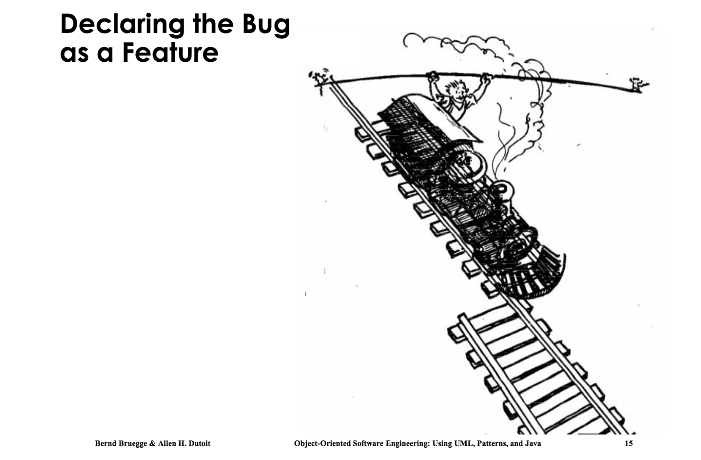
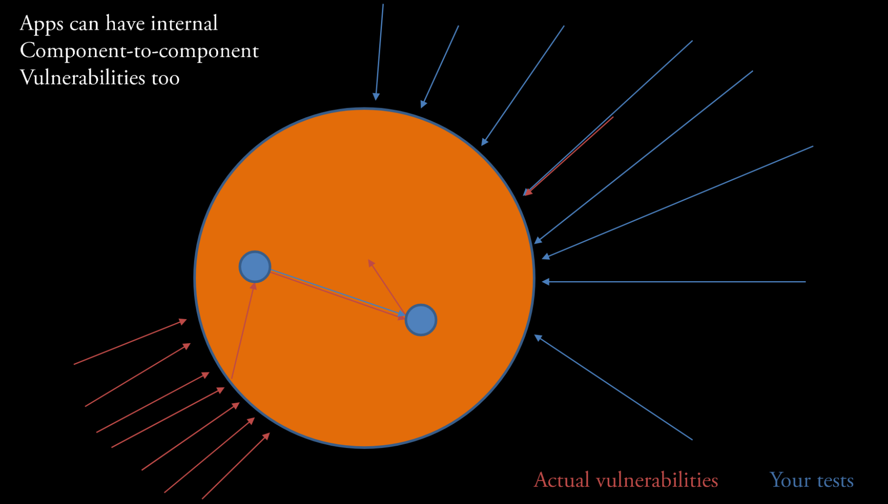

# Penetration Testing

### Cybersecurity First Principles in this lesson

* __Abstraction__: An abstraction is a representation of an object or concept. The gauges in an automobile are an abstraction of the performance of a car. A map is an abstraction of the earth. Abstraction allows us to model an object without considering all of the (possibly infinite) complexity that the object may contain. In this lesson, we use abstraction to model data structures similarly as we did in lesson one.

* __Information Hiding__: Information hiding is any attempt to prevent people from being able to see information. It can be hiding the content of a letter, or it can be applied to hiding how the letter is delivered. Both ways can prevent people from being able to see the information. This lesson looks at how information can be rendered **meaningless** for eavesdroppers using cryptography.

* __Layering__: Cyber security uses multiple layers of defense or protecting information. If one layer is defeated the next layer should catch it. This lesson emphasizes the human element, that is we as humans have to catch problems (like phishing) that make it past the email-level and browser-level filtering mechanisms.

* __Least Privilege__: One of the ways to protect information is by limiting what people can see and do with your information and resources.

* __Minimization__: Minimization refers to having the least functionality necessary in a program or device. The goal of minimization is to simplify and decrease the number of ways that software can be exploited. This can include **turning off ports that are not needed**, reducing the amount of code running on a machine, and/or turning off unneeded features in an application. This lesson focuses specifically on turning off ports that aren't in use.

* __Modularization__: The concept of modularity is like building blocks. Each block (or module) can be put in or taken out from a bigger project. Each module has its own separate function that is interchangeable with other modules.

* __Resource Encapsulation__: A resource can be hardware such as memory, disk drives, or a display screen. It can also be system objects such as semaphores, a linked list, or shared memory. Processes (or programs) need resources to run. Resources have to be separated and used in the way they were intended. Virtual machines encapsulate an operating system and all of the processes and applications it contains.

* __Simplicity__: Simplicity allows a person to better understand hardware and software. Without the clutter of unnecessarily complicated code and interfaces, the software will be more understandable by people that will update the code when requirements change. It will be easier to understand by the testers and they will be able to spot problems sooner. By keeping software as simple and as focused as possible, the reliability and security is greatly increased.

### Introduction
In this module you will probe the server you created before to see how insecure API endpoints can be.

### Goals
By the end of this tutorial, you will be able to:
* Use a REST Client to make malicious `POST` and `GET` requests to an `API`
* Identify `vulnerabilities` in API endpoints
* Trace `vulnerabilities` back to the code `weaknesses`
* Conduct a `risk assessment`

### Materials Required
For this lesson, you will need:

* PC
* Internet connection
* Little bits cloud bit and API Key
* Little bits sensor and actuator

### Prerequisite lessons
You should complete the following lessones before proceeding with this one.
* [Hands on IoT: Little Bits Intro](../hands-on-iot-little-bits-intro/README.md)
* [Hands on IoT: Build an IFTTT IoT app w/ Little Bits](../hands-on-iot-little-bits-ifttt-app/README.md)
* [RESTFul APIs](../restful-api/README.md)
* [Containers](../containers/README.md)
* [Building a server](../building-a-server/README.md)

### Table of Contents

### Step 1: Where we left off
When we left off, you had created an `endpoint` to make the button work to send a message to your `cloudbit`. We had to store our API key on the server to make this work. Our endpoint accepted a POST request to turn on the device. We also integrated our server with `Littleibts API` to `subscribe` to events that occured on the cloudbit.

In this lesson we will take a look at the security implications of this service integration to see how our server isn't well protected against attacks.

### Step 2: Key Penetration Testing Concepts
`Penetration testing` is a special kind of `software testing` that evaluates the `attack surface` of an application for potential exploitable `vulnerabilities`. At the end of a penetration test, testers have more information about their product and more `assurance` that it will operate correctly in the real world. This section overviews the basics of testing.

At its core, penetration testing, is about trying to **make an app do something it wasn't designed for** and **discover oversights or problems in the implementation and design**.

First of all, what is this?

 > Image credit: Bruegge and Dutoit, _Object-oriented Software Engineering: Using UML, Patterns, and Java_, Prentice Hall, 2010

* It all depends on what the goal of the app is. Maybe this is _how it is supposed to work_ - but probably not.

* `Errors` are when things are about to go wrong. The system enters an `error state`
* `Faults` are the root causes of `errors`
* `Failures` occur after errors and can potentially bring down or harm other systems leading to more errors and failures.

 > Image credit: Bruegge and Dutoit, _Object-oriented Software Engineering: Using UML, Patterns, and Java_, Prentice Hall, 2010

#### Reasons for Errors
There can be many different scenarios that lead to errors.
* Maybe the design is bad.
* Maybe something went wrong with the implementation (an `algorithm fault`)
* Maybe something occurs in the deployment environment that changes the setup and causes a `mechanical fault`

> Image credit: Bruegge and Dutoit, _Object-oriented Software Engineering: Using UML, Patterns, and Java_, Prentice Hall, 2010

 > Image credit: Bruegge and Dutoit, _Object-oriented Software Engineering: Using UML, Patterns, and Java_, Prentice Hall, 2010

#### What can we do about errors and faults?
We can Test! The goal of testing is to discover `faults` before they lead to `errors`. Once we know what is wrong, we can `mitigate` it in some way to prevent it from becoming an issue.

* Testing often means traversing the different ways in which your app operates.
* This is especially true for `penetration` tests which identify `security faults` (commonly known as `vulnerabilities`).

> Image credit: Bruegge and Dutoit, _Object-oriented Software Engineering: Using UML, Patterns, and Java_, Prentice Hall, 2010

* Once we know, from testing, that `faults` exist, we can `patch` our code to remove it and prevent errors.

> Image credit: Bruegge and Dutoit, _Object-oriented Software Engineering: Using UML, Patterns, and Java_, Prentice Hall, 2010

* Another option is to design our app from the beginning to handle faults by design. This is a concept called `redundancy`. Redundancy is vitally important for high-criticality systems like those that are operated by NASA, The Department of Defense, and others. `Redundancy` helps, in combination with patching, to ensure that if `errors` do occur they don't cause `failures` before they can be patched.

> Image credit: Bruegge and Dutoit, _Object-oriented Software Engineering: Using UML, Patterns, and Java_, Prentice Hall, 2010

* You can also embrace the chaos. It usually doesn't go well...

> Image credit: Bruegge and Dutoit, _Object-oriented Software Engineering: Using UML, Patterns, and Java_, Prentice Hall, 2010

* Author note: I love these images from Bruegge and Dutoit!

### Step 3: Penetration testing process
Ok, so we understand the basics of testing. How do developers think about penetration testing?

Often `use cases` and `user stories` are used to define what a system should be doing.

* For our app, some user stories might be:
1. As a **cloudbit owner**, I want to **control my lights from my phone**, so that _I don't have to get off the couch to turn them on or off_.
1. As a **cloudbit owner**, I want to **view previous device events**, so that _I know when my device was used_.

Once you know what the app _should_ do, you can define `mis-use cases` or `mis-user stories` that describe how bad actors might abuse or impair the use cases and user stories. These `mis-use` scenarios guide the kind of penetration testing you might do.

Anytime your app is on the internet you end up having a basic set of `mis-use cases` that revolve around the exploitation of web resources for nefarious purposes.

A short list of mis-use cases includes:
* Data theft
* User data exfiltration
* Hostile server takeover

These goals, which can be written like `user stories` often involve some form of `web-based-attack`. We are going to look at our server, created in the previous [lesson](../building-a-server/README.md) to see where it may be vulnerable to attack.

In general, you can follow this flow chart for thinking about penetration testing (and testing in general):

* A `test case` is just a series of steps to see if the test fails or succeeds
* A `mitigation` is a process to correct the `faults` identified during testing.

#### Test Coverage
In practice, when you are evaluating real-world apps, you want to have strong `coverage` across the app's `attack surface` to ensure you don't miss something by being too focused in one particular area.

I like to think of tests graphically:

* In this example, most of the tests that have been conducted are located on part of the app that doesn't have many vulnerabilities. These tests identify one vulnerability (upper right), but miss a highly vulnerable area of the app.
* Maybe this is a `component` that is outdated or not well designed.

Unfortunately, the surface is not the only place where vulnerabilities can occur.

* `Attack vectors` (i.e. pathways that exploit vulnerabilities) can use one vulnerability to get access into other areas in your app. Those internal components might be less `hardened` against attack.
* Takeaway: It is important to test **all** of your components and surfaces.

### Step 4: Getting started testing in POSTMAN
We've created this pretty cool API and nice client-side interface to use it. However, as you will see, our API is, by default, pretty insecure! In the next sections we will see just how bad it is by using some penetration tests to identify and highlight problems.

* We will look at them one at a time. First lets start our server. Change into your `nebraska-gencyber-dev-env` folder.
* type `docker-compose up` to run the server
* Now open `POSTMAN` and send a simple `GET` request to your local server at `https://localhost`.
* What do you get?
* Now try sending a `GET` to `https://localhost/api/deviceevents`
* What do you see?

### Step 5: Exploring Authentication and permissions
The first issue on our server, is that it doesn't enforce `authentication`. This violates the __least privilege__ first principle, because anonymous users should only be able to login, not see or interact with data.

* Lets go back to our browser and go to http://localhost.
* If you are logged in, click `logout`
* What do you see?

What gives? Our data is still visible when we are logged out.
This is because our server is not enforcing authentication on its `API endpoints`

### Step 6: Exploring the Device endpoint

### Step 7: Exploring the DeviceEvent endpoint

### Step 8: Exploring Error Handling Behavior

### Step 9: Crafting a cross-site scripting request

### Step 10: Risk Assessment - Summarizing your test results

### Checkpoint
Lets review what we've learned.

               <h2>UNIT 5: Access control and Permissions</h2>
               <h3 class="taskitem">10. See how vulnerable the API is by default</h3>
               Finally,   
                
                
               Thinking about this screenshot, it might occur to you that this is problematic. This issue illustrates the failure of a cybersecurity first principle: Resource encapsulation. The REST APIs are currently an "exposed representation" that can be invoked independent of other interfaces. Right now, all of our API calls can be executed without a user actually being logged in. To prove this and explore just how bad the security of the API is, we will be using a tool called the 'advanced rest client' Open the tool by going <a href="chrome-extension://bljmokabgbdkoefbmccaeficehkmlnao/RestClient.html" target="_parent">here</a>. 

               Once opened, lets start with a simple GET request to http://localhost:8000/api/likes/. Enter the url, select GET and hit 'send'. As you can see the data is wide open without authentication or permissions. 
                
               Next lets try making an un-authenticated POST request. Select POST, click 'form', and then enter the following key / value pairs in the payload.
               user: 1 
               title: &lt;p onmouseover=javascript:alert('well, this is insecure')&gt;test&lt;/p&gt; 
               objid: 1000 
               secret: hi 
               server: hi 
               farm: hi 
               When done, hit send.
                
                
               Notice that it happily accepts the submission and produces the new like for us. This is a totally random, unauthenticated user that just made an arbitrary textual post to another user's profile page. Worse, the post has malicious javascript in it that could run if the real user 1 sees the page. Lets check this out. Going back and signing in as student and going to the student user profile we see <a href=localhost:8000/profile/1>localhost:8000/profile/1</a>: 
                
               Clearly, the attack has been injected into the user's browser - thankfully ember filters out these basic kinds of attacks automatically. That said - we shouldnt rely on in-browser and in-framework protections - we should make the API itself be more secure. 
               Lets try two more attacks - a PUT (to overrite existing content) and a DELETE - to remove content entirely. Change the target address to http://localhost:8000/api/likes/&lt;idjustcreated&gt;/ where &lt;idjustcreated&gt; is replaced with the number returned under 'id' in the response for the previous request, for me that number is 27. Change the title to something else - like "see what i did here" and send. As you can see - anonymous users can overrite existing data - a huge problem! &nbsp 
                
                
               Lastly, lets DELETE this item entirely. Select DELETE and just hit send. 
                
               Poof - there it goes.  Check it yourself: <a href=http://localhost:8000/profile/1>http://localhost:8000/profile/1</a>. Log in as student, if you are not already logged in, to notice the deleted "see what i did" post that we have put there before.
             
<!-- End Task 10-->
             

               <h3 class="taskitem">11. Adding access control and permissions for API calls</h3>
               Obviously there are lots of problems with these default security measures. Lets start by actually requiring users to at least authenticate before they can make requests to the API. 
               To enable authenticated views only, we need to open /var/www/gencybersite/gencybersite/settings.py in sublime 
               Scroll down until you see the REST_FRAMEWORK block and add in the following: 
               <pre><code>'DEFAULT_PERMISSION_CLASSES': [
   'rest_framework.permissions.IsAuthenticated'
]

### Additional Resources
For more information, investigate the following.

* [http://developers.littlebitscloud.cc/](http://developers.littlebitscloud.cc/) - API reference for the Littlebits web service.

### Acknowledgements
Special thanks to [Dr. Robin Gandhi](http://faculty.ist.unomaha.edu/rgandhi/), Andrew Li, and April Guerin for reviewing and editing this module.

### License
[Nebraska GenCyber](https://github.com/MLHale/nebraska-gencyber)   is licensed under a <a rel="license" href="http://creativecommons.org/licenses/by-nc-sa/4.0/">Creative Commons Attribution-NonCommercial-ShareAlike 4.0 International License</a>.

Overall content: Copyright (C) 2017  [Dr. Matthew L. Hale](http://faculty.ist.unomaha.edu/mhale/), [Dr. Robin Gandhi](http://faculty.ist.unomaha.edu/rgandhi/), and [Doug Rausch](http://www.bellevue.edu/about/leadership/faculty/rausch-douglas).

Lesson content: Copyright (C) [Dr. Matthew Hale](http://faculty.ist.unomaha.edu/mhale/) 2017.  
 This lesson is licensed by the author under a <a rel="license" href="http://creativecommons.org/licenses/by-nc-sa/4.0/">Creative Commons Attribution-NonCommercial-ShareAlike 4.0 International License</a>.
