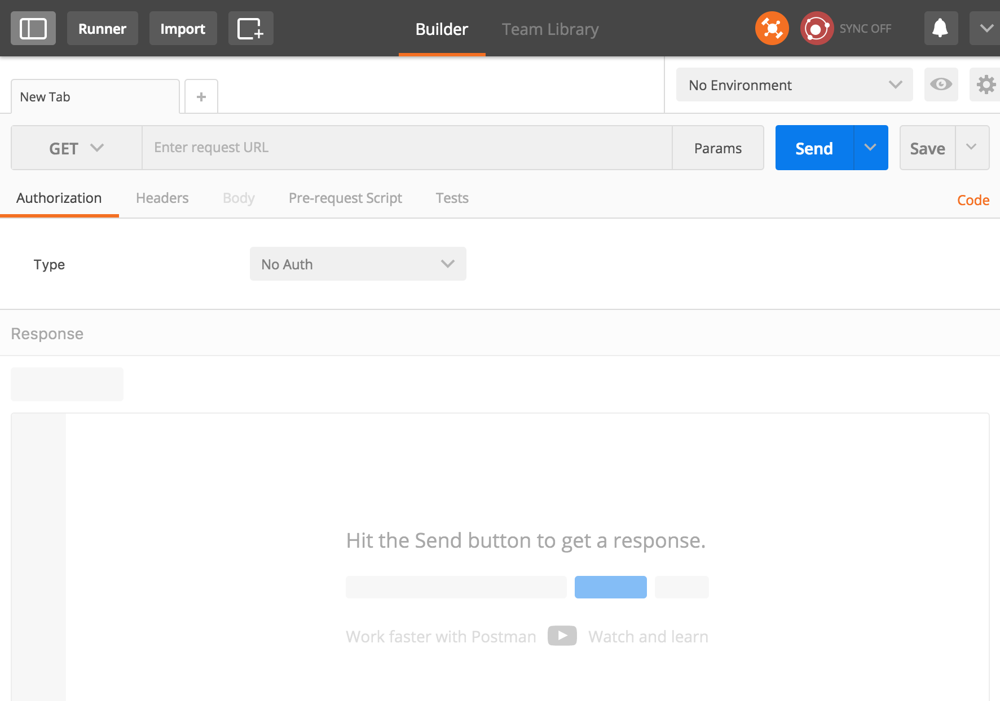
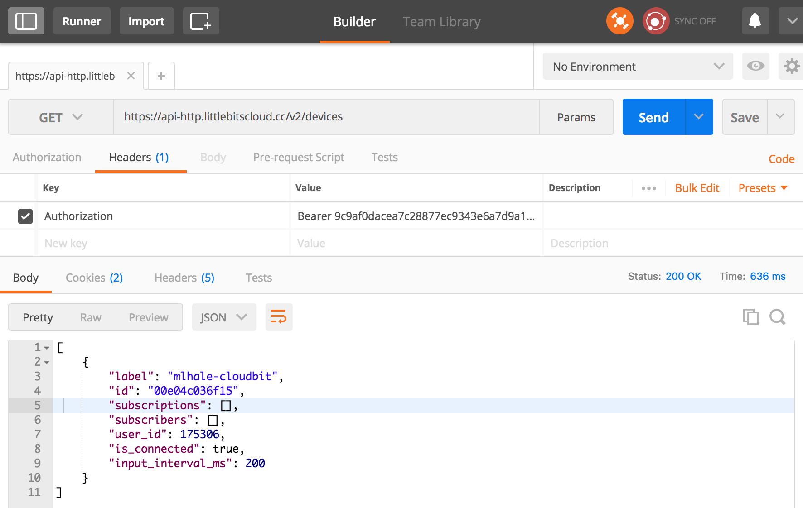
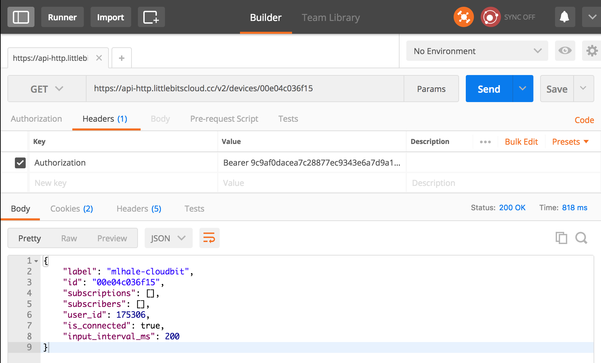
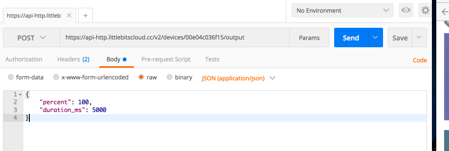

# RESTFul APIs and Little bits

### Cybersecurity First Principles in this lesson
 (delete this line and all bullets that do not apply )

* __Abstraction__: An abstraction is a representation of an object or concept. The gauges in an automobile are an abstraction of the performance of a car. A map is an abstraction of the earth. Abstraction allows us to model an object without considering all of the (possibly infinite) complexity that the object may contain. In this lesson, we use abstraction to model data structures similarly as we did in lesson one.

* __Information Hiding__: Information hiding is any attempt to prevent people from being able to see information. It can be hiding the content of a letter, or it can be applied to hiding how the letter is delivered. Both ways can prevent people from being able to see the information. This lesson looks at how information can be rendered **meaningless** for eavesdroppers using cryptography.

* __Layering__: Cyber security uses multiple layers of defense or protecting information. If one layer is defeated the next layer should catch it. This lesson emphasizes the human element, that is we as humans have to catch problems (like phishing) that make it past the email-level and browser-level filtering mechanisms.

* __Least Privilege__: One of the ways to protect information is by limiting what people can see and do with your information and resources.

* __Minimization__: Minimization refers to having the least functionality necessary in a program or device. The goal of minimization is to simplify and decrease the number of ways that software can be exploited. This can include **turning off ports that are not needed**, reducing the amount of code running on a machine, and/or turning off unneeded features in an application. This lesson focuses specifically on turning off ports that aren't in use.

* __Modularization__: The concept of modularity is like building blocks. Each block (or module) can be put in or taken out from a bigger project. Each module has its own separate function that is interchangeable with other modules.

* __Resource Encapsulation__: A resource can be hardware such as memory, disk drives, or a display screen. It can also be system objects such as semaphores, a linked list, or shared memory. Processes (or programs) need resources to run. Resources have to be separated and used in the way they were intended. Virtual machines encapsulate an operating system and all of the processes and applications it contains.

* __Simplicity__: Simplicity allows a person to better understand hardware and software. Without the clutter of unnecessarily complicated code and interfaces, the software will be more understandable by people that will update the code when requirements change. It will be easier to understand by the testers and they will be able to spot problems sooner. By keeping the software as simple and as focused as possible, the reliability and security are greatly increased.

### Introduction
In this module, you will learn what a RESTful API is, how Littlebits uses APIs to monitor and issue commands to the cloudbit, and how you can use the Littlebits API yourself.

### Goals
By the end of this tutorial, you will be able to:
* Define `REST`, `an endpoint`, `API Integration`, and `API Invocation`
* Use a REST Client to make `POST` and `GET` requests to an `API`
* Using manual requests to `mashup` web services


### Materials Required
For this lesson, you will need:

* PC
* Internet connection
* Little bits cloud bit and API Key
* Little bits sensor and actuator

### Prerequisite lessons
You should complete the [Hands on IoT: Little Bits Intro](../hands-on-iot-little-bits-intro/README.md) and [Hands on IoT: Build an IFTTT IoT app w/ Little Bits](../hands-on-iot-little-bits-ifttt-app/README.md) lessons before attempting this lesson.

### Table of Contents
<!-- TOC START min:1 max:3 link:true update:true -->
- [RESTFul APIs and Little bits](#restful-apis-and-little-bits)
    - [Cybersecurity First Principles in this lesson](#cybersecurity-first-principles-in-this-lesson)
    - [Introduction](#introduction)
    - [Goals](#goals)
    - [Materials Required](#materials-required)
    - [Prerequisite lessons](#prerequisite-lessons)
    - [Table of Contents](#table-of-contents)
    - [Step 1: Hands-on Demo](#step-1-hands-on-demo)
    - [Step 2: Ok, lets take a look at a real API](#step-2-ok-lets-take-a-look-at-a-real-api)
    - [Step 3: Getting our API Key](#step-3-getting-our-api-key)
    - [Step 4: Making your first REST request](#step-4-making-your-first-rest-request)
    - [Step 5: GET device info](#step-5-get-device-info)
    - [Step 6: First POST request to turn the device on](#step-6-first-post-request-to-turn-the-device-on)
    - [Checkpoint](#checkpoint)
    - [Step 7: Adding a subscriber to handle incoming events.](#step-7-adding-a-subscriber-to-handle-incoming-events)
    - [Additional Resources](#additional-resources)
    - [Acknowledgements](#acknowledgements)
    - [License](#license)

<!-- TOC END -->

### Step 1: Hands-on Demo
Before we get started, lets talk about what an API is.

### Step 2: Ok, lets take a look at a real API
In the previous [lesson](../hands-on-iot-little-bits-ifttt-app/README.md), we wired our `cloudbit` up to the web and explored how we could send it signals using [IFTTT](www.ifttt.com). We saw that if our cloud bit detected an input signal (a `request`), we could have `IFTTT` do something (send a `response`). These concepts, i.e. _request_ and _response_, are central to the concept of `RESTful APIs`. REST, or REpresentational State Transfer, APIs, or Application Programming Interfaces, are tools that developers use to provide __abstraction__ and __resource encapsulation__ to people who want to interact with their data.

APIs allow you to get and save data back to the application, without needing to tightly integrate with that application. This improves __simplicity__ and helps your code to be more __modular__. APIs include `endpoints`, such as `/api/events`, that allow you to access certain specific data (e.g. events in this example). API endpoints help provide __minimization__ since users can only interact with the application through those interfaces provided by the developer.

...Enough talk! Lets look at an API!

Open Chrome and go to http://developers.littlebitscloud.cc/. You are looking at the `cloudbit` API. This is what `IFTTT` uses to handle requests and responses.

You can see that Littlebits tells us all about how to interact with our `cloudbit` using the API. Lets try it out.

### Step 3: Getting our API Key
Secure APIs don't just accept requests and provide responses to anyone. APIs use a concept called `least privilege` to allow end-users to only have access to the features they need. Since we own the cloudbit, we should have the ability to do anything we want with it, but we might want to prevent other people from abusing and misusing our cloudbit.

To ensure that only we can program our cloudbit, Littlebits provides something called an `API Key`. This key is a really long alphanumerical string that would be hard to crack. Lets find our key, so we can issue commands to our cloudbit.

Go to http://control.littlebitscloud.cc/

Login using the account you used in the [previous lesson](../hands-on-iot-little-bits-ifttt-app/README.md)

Once logged in, click on your `cloudbit`:

Now go to the `settings` menu. You should see your access token `API Key`, you will need this string in next steps - so keep it handy. In practice, you wouldn't want to share this with anyone.

### Step 4: Making your first REST request
Now that we have our API Key, lets use it to make a request.

POSTMAN is a REST client, that allows end users to make requests to test their APIs. Lets use it to test the cloudbit API. Launch POSTMAN by typing ```chrome://apps``` into the Chrome address bar, hit enter, and then click the POSTMAN icon.



In POSTMAN, lets build a new GET request targetted at the URL https://api-http.littlebitscloud.cc/v2/devices

* Find and click the ```headers``` button and add the following

```
Authorization: Bearer <your access token with no angled brackets>
```

You can add the header as a key value pair, where the key is ```Authorization``` and the value is ```Bearer <insert your access token here, remove the angled brackets>```. Make sure to use your access token.

* Hit the ```send``` button to issue the _GET request_ to the URL.

If all goes well you should see something like:



* The `response` you got back, when you sent the GET request contains the name and meta information for each of the `cloudbits` currently connected to your account. In the screenshot above, the JSON data returned for me was:

```
[
    {
        "label": "mlhale-cloudbit",
        "id": "00e04c036f15",
        "subscriptions": [],
        "subscribers": [],
        "user_id": 175306,
        "is_connected": true,
        "input_interval_ms": 200
    }
]
```
This tells me the label of my cloudbit is ```mlhale-cloudbit``` and that it currently doesn't have any subscribers or subscriptions.

### Step 5: GET device info
Now that we know our device id, we can use it to make a specific `request` for our device.

* make a new `GET` request in POSTMAN to

```
https://api-http.littlebitscloud.cc/v2/devices/<your-device-id>
```

* e.g. ```https://api-http.littlebitscloud.cc/v2/devices/00e04c036f15``` in my example

You should get the same device info back, but notice that it is now not in square brackets - this means it is a singleton instead of a list.

.

### Step 6: First POST request to turn the device on
Now that we have the basics of GET requests to access device info, lets try issuing a POST request to actually make our device do something.

* Make sure you arrange your Littlebits as shown in the following picture:


* make a POST request using POSTMAN to set the voltage output on the cloudbit for a few seconds

```
https://api-http.littlebitscloud.cc/v2/devices/<your-device-id>/output
```
* e.g. ```https://api-http.littlebitscloud.cc/v2/devices/00e04c036f15/output``` in my example

Before you issue the request make sure the headers are set as follows:

Headers:
```
Authorization: Bearer <your access token>
Content-type: application/json
```


Now set the body to tell cloudbit to turn the LED on at 100% brightness and to stay on for 5 seconds.

Body:
```
{
    "percent": 100,
    "duration_ms": 5000
}
```



Now send the request
You should get back:

```
{
    "success": true
}
```

and you should see your led light up. You just used REST!


### Checkpoint
Lets review what we've learned.

https://www.qzzr.com/c/quiz/429280/8f69a8f7-0a69-4efa-9c3e-2aa38944ed1d

### Step 7: Adding a subscriber to handle incoming events.
Lets add a subscriber to catch input events going to the cloudbit:
* Make a POST request to https://api-http.littlebitscloud.cc/v2/subscriptions
* In our case we want to make a server listen for the cloudbit, so lets use a URI endpoint as the subscriber

same headers as before
body:
```
{
    "publisher_id": "<your device id>",
    "subscriber_id": "http://ourserver.com/endpoint"
}
```

But where is our server? We don't have one yet. We will talk about deploying a server in the next lesson and then come back to this.


### Additional Resources
For more information, investigate the following.

* [http://developers.littlebitscloud.cc/](http://developers.littlebitscloud.cc/) - API reference for the Littlebits web service.

### Acknowledgements
Special thanks to [Dr. Robin Gandhi](http://faculty.ist.unomaha.edu/rgandhi/), Andrew Li, and April Guerin for reviewing and editing this module.

### License
[Nebraska GenCyber](https://github.com/MLHale/nebraska-gencyber) <a rel="license" href="http://creativecommons.org/licenses/by-nc-sa/4.0/"></a><br /> is licensed under a <a rel="license" href="http://creativecommons.org/licenses/by-nc-sa/4.0/">Creative Commons Attribution-NonCommercial-ShareAlike 4.0 International License</a>.

Overall content: Copyright (C) 2017  [Dr. Matthew L. Hale](http://faculty.ist.unomaha.edu/mhale/), [Dr. Robin Gandhi](http://faculty.ist.unomaha.edu/rgandhi/), and [Doug Rausch](http://www.bellevue.edu/about/leadership/faculty/rausch-douglas).

Lesson content: Copyright (C) [Dr. Matthew Hale](http://faculty.ist.unomaha.edu/mhale/) 2017.  
<a rel="license" href="http://creativecommons.org/licenses/by-nc-sa/4.0/"></a><br /><span xmlns:dct="http://purl.org/dc/terms/" property="dct:title">This lesson</span> is licensed by the author under a <a rel="license" href="http://creativecommons.org/licenses/by-nc-sa/4.0/">Creative Commons Attribution-NonCommercial-ShareAlike 4.0 International License</a>.
